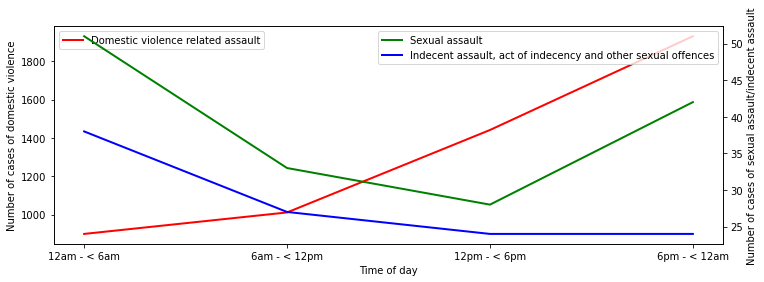
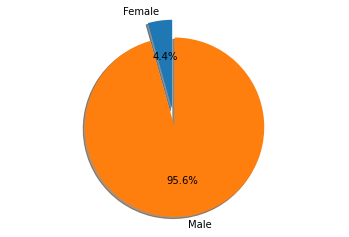

# Analysis of domestic violence, sexual assault, and indecency in NSW

Python code to analyze domestic violence, sexual crimes and other acts of indecency in NSW based on data from the NSW Bureau of Crime Statistics and Research.

# Loading libraries

Let's load relevant Python libraries.


```python
import numpy as np 
import pandas as pd 
import seaborn as sns
import matplotlib.pyplot as plt 
import matplotlib as mpl
import warnings
warnings.filterwarnings("ignore")
```

# Loading data

The dataset was acquired from https://www.bocsar.nsw.gov.au/Pages/bocsar_datasets/Datasets-.aspx. 


```python
filename = 'DomesticViolenceStatistics.xlsx';
data = pd.ExcelFile(filename)
```

Let's list the sheets


```python
data.sheet_names
```


    ['Summary of offences',
     'Premises type',
     'Month',
     'Alcohol related',
     'Time',
     'Location',
     'Offenders',
     'Victims',
     'Aboriginality of Offenders',
     'Aboriginality of victims',
     'POI relationship to victim']


# Analysis of types of premises

Let's analyze premises where domestic violence, sexual crimes and other acts of indecency in NSW occur.


```python
premises = pd.read_excel(filename, 'Premises type')
premises.head(15)
```


<div>
<table border="1" class="dataframe">
  <thead>
    <tr style="text-align: right;">
      <th></th>
      <th>NSW Recorded Crime Statistics April 2019 to March 2020</th>
      <th>Unnamed: 1</th>
      <th>Unnamed: 2</th>
      <th>Unnamed: 3</th>
      <th>Unnamed: 4</th>
      <th>Unnamed: 5</th>
      <th>Unnamed: 6</th>
      <th>Unnamed: 7</th>
      <th>Unnamed: 8</th>
      <th>Unnamed: 9</th>
      <th>Unnamed: 10</th>
      <th>Unnamed: 11</th>
    </tr>
  </thead>
  <tbody>
    <tr>
      <th>0</th>
      <td>NaN</td>
      <td>NaN</td>
      <td>NaN</td>
      <td>NaN</td>
      <td>NaN</td>
      <td>NaN</td>
      <td>NaN</td>
      <td>NaN</td>
      <td>NaN</td>
      <td>NaN</td>
      <td>NaN</td>
      <td>NaN</td>
    </tr>
    <tr>
      <th>1</th>
      <td>Number of recorded domestic violence related i...</td>
      <td>NaN</td>
      <td>NaN</td>
      <td>NaN</td>
      <td>NaN</td>
      <td>NaN</td>
      <td>NaN</td>
      <td>NaN</td>
      <td>NaN</td>
      <td>NaN</td>
      <td>NaN</td>
      <td>NaN</td>
    </tr>
    <tr>
      <th>2</th>
      <td>NaN</td>
      <td>NaN</td>
      <td>NaN</td>
      <td>NaN</td>
      <td>NaN</td>
      <td>NaN</td>
      <td>NaN</td>
      <td>NaN</td>
      <td>NaN</td>
      <td>NaN</td>
      <td>NaN</td>
      <td>NaN</td>
    </tr>
    <tr>
      <th>3</th>
      <td>Premise type</td>
      <td>Murder *</td>
      <td>Attempted murder</td>
      <td>Murder accessory, conspiracy</td>
      <td>Manslaughter *</td>
      <td>Domestic violence related assault</td>
      <td>Sexual assault</td>
      <td>Indecent assault, act of indecency and other s...</td>
      <td>Abduction and kidnapping</td>
      <td>Intimidation, stalking and harassment</td>
      <td>Malicious damage to property</td>
      <td>Breach Apprehended Violence Order</td>
    </tr>
    <tr>
      <th>4</th>
      <td>Adult entertainment</td>
      <td>0</td>
      <td>0</td>
      <td>0</td>
      <td>0</td>
      <td>10</td>
      <td>1</td>
      <td>0</td>
      <td>0</td>
      <td>2</td>
      <td>1</td>
      <td>10</td>
    </tr>
    <tr>
      <th>5</th>
      <td>Financial institution</td>
      <td>0</td>
      <td>0</td>
      <td>0</td>
      <td>0</td>
      <td>8</td>
      <td>0</td>
      <td>0</td>
      <td>0</td>
      <td>6</td>
      <td>0</td>
      <td>5</td>
    </tr>
    <tr>
      <th>6</th>
      <td>Office</td>
      <td>0</td>
      <td>0</td>
      <td>0</td>
      <td>0</td>
      <td>22</td>
      <td>1</td>
      <td>2</td>
      <td>0</td>
      <td>29</td>
      <td>6</td>
      <td>45</td>
    </tr>
    <tr>
      <th>7</th>
      <td>Personal services</td>
      <td>0</td>
      <td>0</td>
      <td>0</td>
      <td>0</td>
      <td>67</td>
      <td>0</td>
      <td>3</td>
      <td>0</td>
      <td>43</td>
      <td>11</td>
      <td>54</td>
    </tr>
    <tr>
      <th>8</th>
      <td>Retail/wholesale</td>
      <td>0</td>
      <td>0</td>
      <td>0</td>
      <td>0</td>
      <td>505</td>
      <td>4</td>
      <td>11</td>
      <td>1</td>
      <td>338</td>
      <td>76</td>
      <td>392</td>
    </tr>
    <tr>
      <th>9</th>
      <td>Carpark</td>
      <td>0</td>
      <td>0</td>
      <td>0</td>
      <td>0</td>
      <td>221</td>
      <td>5</td>
      <td>4</td>
      <td>2</td>
      <td>96</td>
      <td>50</td>
      <td>97</td>
    </tr>
    <tr>
      <th>10</th>
      <td>Education</td>
      <td>0</td>
      <td>0</td>
      <td>0</td>
      <td>0</td>
      <td>93</td>
      <td>3</td>
      <td>2</td>
      <td>1</td>
      <td>85</td>
      <td>10</td>
      <td>118</td>
    </tr>
    <tr>
      <th>11</th>
      <td>Health</td>
      <td>0</td>
      <td>0</td>
      <td>0</td>
      <td>0</td>
      <td>139</td>
      <td>0</td>
      <td>3</td>
      <td>0</td>
      <td>80</td>
      <td>15</td>
      <td>130</td>
    </tr>
    <tr>
      <th>12</th>
      <td>Industrial</td>
      <td>0</td>
      <td>0</td>
      <td>0</td>
      <td>0</td>
      <td>16</td>
      <td>2</td>
      <td>1</td>
      <td>0</td>
      <td>12</td>
      <td>7</td>
      <td>11</td>
    </tr>
    <tr>
      <th>13</th>
      <td>Law enforcement</td>
      <td>0</td>
      <td>0</td>
      <td>0</td>
      <td>0</td>
      <td>83</td>
      <td>2</td>
      <td>4</td>
      <td>0</td>
      <td>263</td>
      <td>16</td>
      <td>735</td>
    </tr>
    <tr>
      <th>14</th>
      <td>Licensed premises</td>
      <td>0</td>
      <td>0</td>
      <td>0</td>
      <td>0</td>
      <td>423</td>
      <td>6</td>
      <td>5</td>
      <td>1</td>
      <td>141</td>
      <td>35</td>
      <td>234</td>
    </tr>
  </tbody>
</table>
</div>


```python
premises.tail(15)
```


<div>
<table border="1" class="dataframe">
  <thead>
    <tr style="text-align: right;">
      <th></th>
      <th>NSW Recorded Crime Statistics April 2019 to March 2020</th>
      <th>Unnamed: 1</th>
      <th>Unnamed: 2</th>
      <th>Unnamed: 3</th>
      <th>Unnamed: 4</th>
      <th>Unnamed: 5</th>
      <th>Unnamed: 6</th>
      <th>Unnamed: 7</th>
      <th>Unnamed: 8</th>
      <th>Unnamed: 9</th>
      <th>Unnamed: 10</th>
      <th>Unnamed: 11</th>
    </tr>
  </thead>
  <tbody>
    <tr>
      <th>21</th>
      <td>Public transport</td>
      <td>0</td>
      <td>0</td>
      <td>0</td>
      <td>0</td>
      <td>134</td>
      <td>0</td>
      <td>2</td>
      <td>0</td>
      <td>40</td>
      <td>8</td>
      <td>130</td>
    </tr>
    <tr>
      <th>22</th>
      <td>Utilities</td>
      <td>0</td>
      <td>0</td>
      <td>0</td>
      <td>0</td>
      <td>2</td>
      <td>0</td>
      <td>0</td>
      <td>0</td>
      <td>12</td>
      <td>0</td>
      <td>9</td>
    </tr>
    <tr>
      <th>23</th>
      <td>Vehicle</td>
      <td>0</td>
      <td>0</td>
      <td>0</td>
      <td>0</td>
      <td>69</td>
      <td>4</td>
      <td>6</td>
      <td>0</td>
      <td>21</td>
      <td>15</td>
      <td>30</td>
    </tr>
    <tr>
      <th>24</th>
      <td>Unknown</td>
      <td>0</td>
      <td>0</td>
      <td>0</td>
      <td>0</td>
      <td>92</td>
      <td>56</td>
      <td>55</td>
      <td>0</td>
      <td>119</td>
      <td>2</td>
      <td>68</td>
    </tr>
    <tr>
      <th>25</th>
      <td>Total</td>
      <td>28</td>
      <td>8</td>
      <td>2</td>
      <td>2</td>
      <td>31457</td>
      <td>1137</td>
      <td>826</td>
      <td>54</td>
      <td>16634</td>
      <td>10519</td>
      <td>17389</td>
    </tr>
    <tr>
      <th>26</th>
      <td>NaN</td>
      <td>NaN</td>
      <td>NaN</td>
      <td>NaN</td>
      <td>NaN</td>
      <td>NaN</td>
      <td>NaN</td>
      <td>NaN</td>
      <td>NaN</td>
      <td>NaN</td>
      <td>NaN</td>
      <td>NaN</td>
    </tr>
    <tr>
      <th>27</th>
      <td>* For murder and manslaughter the data are cou...</td>
      <td>NaN</td>
      <td>NaN</td>
      <td>NaN</td>
      <td>NaN</td>
      <td>NaN</td>
      <td>NaN</td>
      <td>NaN</td>
      <td>NaN</td>
      <td>NaN</td>
      <td>NaN</td>
      <td>NaN</td>
    </tr>
    <tr>
      <th>28</th>
      <td>NaN</td>
      <td>NaN</td>
      <td>NaN</td>
      <td>NaN</td>
      <td>NaN</td>
      <td>NaN</td>
      <td>NaN</td>
      <td>NaN</td>
      <td>NaN</td>
      <td>NaN</td>
      <td>NaN</td>
      <td>NaN</td>
    </tr>
    <tr>
      <th>29</th>
      <td>Source: NSW Bureau of Crime Statistics and Res...</td>
      <td>NaN</td>
      <td>NaN</td>
      <td>NaN</td>
      <td>NaN</td>
      <td>NaN</td>
      <td>NaN</td>
      <td>NaN</td>
      <td>NaN</td>
      <td>NaN</td>
      <td>NaN</td>
      <td>NaN</td>
    </tr>
    <tr>
      <th>30</th>
      <td>Please retain this reference number for future...</td>
      <td>NaN</td>
      <td>NaN</td>
      <td>NaN</td>
      <td>NaN</td>
      <td>NaN</td>
      <td>NaN</td>
      <td>NaN</td>
      <td>NaN</td>
      <td>NaN</td>
      <td>NaN</td>
      <td>NaN</td>
    </tr>
    <tr>
      <th>31</th>
      <td>NaN</td>
      <td>NaN</td>
      <td>NaN</td>
      <td>NaN</td>
      <td>NaN</td>
      <td>NaN</td>
      <td>NaN</td>
      <td>NaN</td>
      <td>NaN</td>
      <td>NaN</td>
      <td>NaN</td>
      <td>NaN</td>
    </tr>
    <tr>
      <th>32</th>
      <td>NOTE: Data sourced from the NSW Bureau of Crim...</td>
      <td>NaN</td>
      <td>NaN</td>
      <td>NaN</td>
      <td>NaN</td>
      <td>NaN</td>
      <td>NaN</td>
      <td>NaN</td>
      <td>NaN</td>
      <td>NaN</td>
      <td>NaN</td>
      <td>NaN</td>
    </tr>
    <tr>
      <th>33</th>
      <td>must be acknowledged in any document (electron...</td>
      <td>NaN</td>
      <td>NaN</td>
      <td>NaN</td>
      <td>NaN</td>
      <td>NaN</td>
      <td>NaN</td>
      <td>NaN</td>
      <td>NaN</td>
      <td>NaN</td>
      <td>NaN</td>
      <td>NaN</td>
    </tr>
    <tr>
      <th>34</th>
      <td>The acknowledgement should take the form of 'S...</td>
      <td>NaN</td>
      <td>NaN</td>
      <td>NaN</td>
      <td>NaN</td>
      <td>NaN</td>
      <td>NaN</td>
      <td>NaN</td>
      <td>NaN</td>
      <td>NaN</td>
      <td>NaN</td>
      <td>NaN</td>
    </tr>
    <tr>
      <th>35</th>
      <td>For information about recorded crime data plea...</td>
      <td>NaN</td>
      <td>NaN</td>
      <td>NaN</td>
      <td>NaN</td>
      <td>NaN</td>
      <td>NaN</td>
      <td>NaN</td>
      <td>NaN</td>
      <td>NaN</td>
      <td>NaN</td>
      <td>NaN</td>
    </tr>
  </tbody>
</table>
</div>


The first 4 rows need to be skipped and the last 11 rows need to be dropped. ('Total' is also not necessary.)
All the columns except Premise type and 'Domestic violence related assault


```python
premises = pd.read_excel(filename, 'Premises type', skiprows=4)
premises = premises.iloc[:-11, :]
```


```python
premises.head()
```


<div>
<table border="1" class="dataframe">
  <thead>
    <tr style="text-align: right;">
      <th></th>
      <th>Premise type</th>
      <th>Murder *</th>
      <th>Attempted murder</th>
      <th>Murder accessory, conspiracy</th>
      <th>Manslaughter *</th>
      <th>Domestic violence related assault</th>
      <th>Sexual assault</th>
      <th>Indecent assault, act of indecency and other sexual offences</th>
      <th>Abduction and kidnapping</th>
      <th>Intimidation, stalking and harassment</th>
      <th>Malicious damage to property</th>
      <th>Breach Apprehended Violence Order</th>
    </tr>
  </thead>
  <tbody>
    <tr>
      <th>0</th>
      <td>Adult entertainment</td>
      <td>0.0</td>
      <td>0.0</td>
      <td>0.0</td>
      <td>0.0</td>
      <td>10.0</td>
      <td>1.0</td>
      <td>0.0</td>
      <td>0.0</td>
      <td>2.0</td>
      <td>1.0</td>
      <td>10.0</td>
    </tr>
    <tr>
      <th>1</th>
      <td>Financial institution</td>
      <td>0.0</td>
      <td>0.0</td>
      <td>0.0</td>
      <td>0.0</td>
      <td>8.0</td>
      <td>0.0</td>
      <td>0.0</td>
      <td>0.0</td>
      <td>6.0</td>
      <td>0.0</td>
      <td>5.0</td>
    </tr>
    <tr>
      <th>2</th>
      <td>Office</td>
      <td>0.0</td>
      <td>0.0</td>
      <td>0.0</td>
      <td>0.0</td>
      <td>22.0</td>
      <td>1.0</td>
      <td>2.0</td>
      <td>0.0</td>
      <td>29.0</td>
      <td>6.0</td>
      <td>45.0</td>
    </tr>
    <tr>
      <th>3</th>
      <td>Personal services</td>
      <td>0.0</td>
      <td>0.0</td>
      <td>0.0</td>
      <td>0.0</td>
      <td>67.0</td>
      <td>0.0</td>
      <td>3.0</td>
      <td>0.0</td>
      <td>43.0</td>
      <td>11.0</td>
      <td>54.0</td>
    </tr>
    <tr>
      <th>4</th>
      <td>Retail/wholesale</td>
      <td>0.0</td>
      <td>0.0</td>
      <td>0.0</td>
      <td>0.0</td>
      <td>505.0</td>
      <td>4.0</td>
      <td>11.0</td>
      <td>1.0</td>
      <td>338.0</td>
      <td>76.0</td>
      <td>392.0</td>
    </tr>
  </tbody>
</table>
</div>


```python
premises.tail()
```


<div>
<table border="1" class="dataframe">
  <thead>
    <tr style="text-align: right;">
      <th></th>
      <th>Premise type</th>
      <th>Murder *</th>
      <th>Attempted murder</th>
      <th>Murder accessory, conspiracy</th>
      <th>Manslaughter *</th>
      <th>Domestic violence related assault</th>
      <th>Sexual assault</th>
      <th>Indecent assault, act of indecency and other sexual offences</th>
      <th>Abduction and kidnapping</th>
      <th>Intimidation, stalking and harassment</th>
      <th>Malicious damage to property</th>
      <th>Breach Apprehended Violence Order</th>
    </tr>
  </thead>
  <tbody>
    <tr>
      <th>16</th>
      <td>Rural industry</td>
      <td>1.0</td>
      <td>0.0</td>
      <td>0.0</td>
      <td>0.0</td>
      <td>5.0</td>
      <td>0.0</td>
      <td>0.0</td>
      <td>0.0</td>
      <td>3.0</td>
      <td>3.0</td>
      <td>4.0</td>
    </tr>
    <tr>
      <th>17</th>
      <td>Public transport</td>
      <td>0.0</td>
      <td>0.0</td>
      <td>0.0</td>
      <td>0.0</td>
      <td>134.0</td>
      <td>0.0</td>
      <td>2.0</td>
      <td>0.0</td>
      <td>40.0</td>
      <td>8.0</td>
      <td>130.0</td>
    </tr>
    <tr>
      <th>18</th>
      <td>Utilities</td>
      <td>0.0</td>
      <td>0.0</td>
      <td>0.0</td>
      <td>0.0</td>
      <td>2.0</td>
      <td>0.0</td>
      <td>0.0</td>
      <td>0.0</td>
      <td>12.0</td>
      <td>0.0</td>
      <td>9.0</td>
    </tr>
    <tr>
      <th>19</th>
      <td>Vehicle</td>
      <td>0.0</td>
      <td>0.0</td>
      <td>0.0</td>
      <td>0.0</td>
      <td>69.0</td>
      <td>4.0</td>
      <td>6.0</td>
      <td>0.0</td>
      <td>21.0</td>
      <td>15.0</td>
      <td>30.0</td>
    </tr>
    <tr>
      <th>20</th>
      <td>Unknown</td>
      <td>0.0</td>
      <td>0.0</td>
      <td>0.0</td>
      <td>0.0</td>
      <td>92.0</td>
      <td>56.0</td>
      <td>55.0</td>
      <td>0.0</td>
      <td>119.0</td>
      <td>2.0</td>
      <td>68.0</td>
    </tr>
  </tbody>
</table>
</div>


We are only interested in three columns and 'Premise type'. Let's keep only these four and drop the rest. 'Premise type' should be marked as index.


```python
data_of_interest = ['Premise type', 'Domestic violence related assault','Sexual assault', 'Indecent assault, act of indecency and other sexual offences']
premises = premises[data_of_interest]
premises = premises.set_index('Premise type')
premises.head()
```


<div>
<table border="1" class="dataframe">
  <thead>
    <tr style="text-align: right;">
      <th></th>
      <th>Domestic violence related assault</th>
      <th>Sexual assault</th>
      <th>Indecent assault, act of indecency and other sexual offences</th>
    </tr>
    <tr>
      <th>Premise type</th>
      <th></th>
      <th></th>
      <th></th>
    </tr>
  </thead>
  <tbody>
    <tr>
      <th>Adult entertainment</th>
      <td>10.0</td>
      <td>1.0</td>
      <td>0.0</td>
    </tr>
    <tr>
      <th>Financial institution</th>
      <td>8.0</td>
      <td>0.0</td>
      <td>0.0</td>
    </tr>
    <tr>
      <th>Office</th>
      <td>22.0</td>
      <td>1.0</td>
      <td>2.0</td>
    </tr>
    <tr>
      <th>Personal services</th>
      <td>67.0</td>
      <td>0.0</td>
      <td>3.0</td>
    </tr>
    <tr>
      <th>Retail/wholesale</th>
      <td>505.0</td>
      <td>4.0</td>
      <td>11.0</td>
    </tr>
  </tbody>
</table>
</div>


```python
premises.plot.bar(figsize=(15, 5))
plt.ylabel('Number of cases')
plt.grid(color='gray', linestyle='dotted', linewidth=0.3)
```


We can see from the above picture that domestic violence related assults mostly occur at home. Let's lower the maximum value of the bar chart to zoom into other bars.


```python
premises.plot.bar(figsize=(15, 5))
plt.grid(color='gray', linestyle='dotted', linewidth=0.3)
plt.ylabel('Number of cases')
plt.ylim(0, 3000)
```


    (0.0, 3000.0)


We can see from the above picture that domestic violence related assults and sexual offences mostly occur at home. Outdoor places are the second most common type of places where domestic violence occurs.


```python
premises.plot.bar(figsize=(15, 5))
plt.grid(color='gray', linestyle='dotted', linewidth=0.3)
plt.ylabel('Number of cases')
plt.ylim(0, 1000)
```


    (0.0, 1000.0)


# Seasonality

Let's analyze seasonal patterns of domestic violence, sexual crimes and other acts of indecency in NSW.


```python
seasonality = pd.read_excel(filename, 'Month')
seasonality.head()
```


<div>
<table border="1" class="dataframe">
  <thead>
    <tr style="text-align: right;">
      <th></th>
      <th>NSW Recorded Crime Statistics April 2019 to March 2020</th>
      <th>Unnamed: 1</th>
      <th>Unnamed: 2</th>
      <th>Unnamed: 3</th>
      <th>Unnamed: 4</th>
      <th>Unnamed: 5</th>
      <th>Unnamed: 6</th>
      <th>Unnamed: 7</th>
      <th>Unnamed: 8</th>
      <th>Unnamed: 9</th>
      <th>Unnamed: 10</th>
      <th>Unnamed: 11</th>
      <th>Unnamed: 12</th>
    </tr>
  </thead>
  <tbody>
    <tr>
      <th>0</th>
      <td>NaN</td>
      <td>NaN</td>
      <td>NaN</td>
      <td>NaN</td>
      <td>NaN</td>
      <td>NaN</td>
      <td>NaN</td>
      <td>NaN</td>
      <td>NaN</td>
      <td>NaN</td>
      <td>NaN</td>
      <td>NaN</td>
      <td>NaN</td>
    </tr>
    <tr>
      <th>1</th>
      <td>Number of recorded domestic violence related i...</td>
      <td>NaN</td>
      <td>NaN</td>
      <td>NaN</td>
      <td>NaN</td>
      <td>NaN</td>
      <td>NaN</td>
      <td>NaN</td>
      <td>NaN</td>
      <td>NaN</td>
      <td>NaN</td>
      <td>NaN</td>
      <td>NaN</td>
    </tr>
    <tr>
      <th>2</th>
      <td>NaN</td>
      <td>NaN</td>
      <td>NaN</td>
      <td>NaN</td>
      <td>NaN</td>
      <td>NaN</td>
      <td>NaN</td>
      <td>NaN</td>
      <td>NaN</td>
      <td>NaN</td>
      <td>NaN</td>
      <td>NaN</td>
      <td>NaN</td>
    </tr>
    <tr>
      <th>3</th>
      <td>Offence type</td>
      <td>Apr 2019</td>
      <td>May 2019</td>
      <td>Jun 2019</td>
      <td>Jul 2019</td>
      <td>Aug 2019</td>
      <td>Sep 2019</td>
      <td>Oct 2019</td>
      <td>Nov 2019</td>
      <td>Dec 2019</td>
      <td>Jan 2020</td>
      <td>Feb 2020</td>
      <td>Mar 2020</td>
    </tr>
    <tr>
      <th>4</th>
      <td>Murder *</td>
      <td>1</td>
      <td>2</td>
      <td>1</td>
      <td>2</td>
      <td>6</td>
      <td>2</td>
      <td>3</td>
      <td>5</td>
      <td>0</td>
      <td>3</td>
      <td>1</td>
      <td>2</td>
    </tr>
  </tbody>
</table>
</div>


As before, the first four rows should be skipped because they are part of the explanation text in the Exel file.


```python
seasonality = pd.read_excel(filename, 'Month', skiprows=4)
```


```python
seasonality.head()
```


<div>
<table border="1" class="dataframe">
  <thead>
    <tr style="text-align: right;">
      <th></th>
      <th>Offence type</th>
      <th>Apr 2019</th>
      <th>May 2019</th>
      <th>Jun 2019</th>
      <th>Jul 2019</th>
      <th>Aug 2019</th>
      <th>Sep 2019</th>
      <th>Oct 2019</th>
      <th>Nov 2019</th>
      <th>Dec 2019</th>
      <th>Jan 2020</th>
      <th>Feb 2020</th>
      <th>Mar 2020</th>
    </tr>
  </thead>
  <tbody>
    <tr>
      <th>0</th>
      <td>Murder *</td>
      <td>1.0</td>
      <td>2.0</td>
      <td>1.0</td>
      <td>2.0</td>
      <td>6.0</td>
      <td>2.0</td>
      <td>3.0</td>
      <td>5.0</td>
      <td>0.0</td>
      <td>3.0</td>
      <td>1.0</td>
      <td>2.0</td>
    </tr>
    <tr>
      <th>1</th>
      <td>Attempted murder</td>
      <td>1.0</td>
      <td>1.0</td>
      <td>2.0</td>
      <td>2.0</td>
      <td>0.0</td>
      <td>0.0</td>
      <td>0.0</td>
      <td>1.0</td>
      <td>0.0</td>
      <td>1.0</td>
      <td>0.0</td>
      <td>0.0</td>
    </tr>
    <tr>
      <th>2</th>
      <td>Murder accessory, conspiracy</td>
      <td>0.0</td>
      <td>0.0</td>
      <td>0.0</td>
      <td>0.0</td>
      <td>0.0</td>
      <td>0.0</td>
      <td>0.0</td>
      <td>0.0</td>
      <td>0.0</td>
      <td>1.0</td>
      <td>0.0</td>
      <td>1.0</td>
    </tr>
    <tr>
      <th>3</th>
      <td>Manslaughter *</td>
      <td>0.0</td>
      <td>0.0</td>
      <td>0.0</td>
      <td>0.0</td>
      <td>0.0</td>
      <td>1.0</td>
      <td>0.0</td>
      <td>0.0</td>
      <td>1.0</td>
      <td>0.0</td>
      <td>0.0</td>
      <td>0.0</td>
    </tr>
    <tr>
      <th>4</th>
      <td>Domestic violence related assault</td>
      <td>2434.0</td>
      <td>2294.0</td>
      <td>2347.0</td>
      <td>2359.0</td>
      <td>2495.0</td>
      <td>2525.0</td>
      <td>2661.0</td>
      <td>2772.0</td>
      <td>3135.0</td>
      <td>3128.0</td>
      <td>2550.0</td>
      <td>2757.0</td>
    </tr>
  </tbody>
</table>
</div>


Let's only keep the three rows that we are interested in analyzing.


```python
data_of_interest = ['Domestic violence related assault','Sexual assault', 'Indecent assault, act of indecency and other sexual offences']
seasonality = seasonality[seasonality['Offence type'].isin(data_of_interest)]
seasonality.head()
```


<div>
<table border="1" class="dataframe">
  <thead>
    <tr style="text-align: right;">
      <th></th>
      <th>Offence type</th>
      <th>Apr 2019</th>
      <th>May 2019</th>
      <th>Jun 2019</th>
      <th>Jul 2019</th>
      <th>Aug 2019</th>
      <th>Sep 2019</th>
      <th>Oct 2019</th>
      <th>Nov 2019</th>
      <th>Dec 2019</th>
      <th>Jan 2020</th>
      <th>Feb 2020</th>
      <th>Mar 2020</th>
    </tr>
  </thead>
  <tbody>
    <tr>
      <th>4</th>
      <td>Domestic violence related assault</td>
      <td>2434.0</td>
      <td>2294.0</td>
      <td>2347.0</td>
      <td>2359.0</td>
      <td>2495.0</td>
      <td>2525.0</td>
      <td>2661.0</td>
      <td>2772.0</td>
      <td>3135.0</td>
      <td>3128.0</td>
      <td>2550.0</td>
      <td>2757.0</td>
    </tr>
    <tr>
      <th>5</th>
      <td>Sexual assault</td>
      <td>81.0</td>
      <td>95.0</td>
      <td>81.0</td>
      <td>88.0</td>
      <td>84.0</td>
      <td>108.0</td>
      <td>103.0</td>
      <td>105.0</td>
      <td>95.0</td>
      <td>122.0</td>
      <td>91.0</td>
      <td>84.0</td>
    </tr>
    <tr>
      <th>6</th>
      <td>Indecent assault, act of indecency and other s...</td>
      <td>54.0</td>
      <td>64.0</td>
      <td>63.0</td>
      <td>74.0</td>
      <td>71.0</td>
      <td>84.0</td>
      <td>61.0</td>
      <td>77.0</td>
      <td>73.0</td>
      <td>67.0</td>
      <td>71.0</td>
      <td>67.0</td>
    </tr>
  </tbody>
</table>
</div>


There are a few things that need to be done:
1. The offence type has to be set as index
2. The table has to be transposed
3. The date column has to be parsed as datetime


```python
seasonality.rename(columns={"Offence type": ""}, inplace=True)
seasonality = seasonality.set_index('')
seasonality = seasonality.T
seasonality.index = pd.to_datetime(seasonality.index, infer_datetime_format=True)
seasonality.head()
```


<div>
<table border="1" class="dataframe">
  <thead>
    <tr style="text-align: right;">
      <th></th>
      <th>Domestic violence related assault</th>
      <th>Sexual assault</th>
      <th>Indecent assault, act of indecency and other sexual offences</th>
    </tr>
  </thead>
  <tbody>
    <tr>
      <th>2019-04-01</th>
      <td>2434.0</td>
      <td>81.0</td>
      <td>54.0</td>
    </tr>
    <tr>
      <th>2019-05-01</th>
      <td>2294.0</td>
      <td>95.0</td>
      <td>64.0</td>
    </tr>
    <tr>
      <th>2019-06-01</th>
      <td>2347.0</td>
      <td>81.0</td>
      <td>63.0</td>
    </tr>
    <tr>
      <th>2019-07-01</th>
      <td>2359.0</td>
      <td>88.0</td>
      <td>74.0</td>
    </tr>
    <tr>
      <th>2019-08-01</th>
      <td>2495.0</td>
      <td>84.0</td>
      <td>71.0</td>
    </tr>
  </tbody>
</table>
</div>


```python
seasonality['Domestic violence related assault'].plot(kind = 'line', color='r', label='Domestic violence related assault',linewidth=2,alpha = 1,grid = True,linestyle = '-', figsize=(12, 4))
#plt.legend(bbox_to_anchor=(1.05, 1))     
plt.xlabel('')              
plt.ylabel('Number of cases')    
plt.title('Domestic violence related assault')
plt.show()    


seasonality['Sexual assault'].plot(kind = 'line', color='b', label='Sexual assault', linewidth=2,alpha = 1,grid = True,linestyle = '-', figsize=(12, 4))
#plt.legend(bbox_to_anchor=(1.05, 1))     
plt.xlabel('')              
plt.ylabel('Number of cases')     
plt.title('Sexual assault')
plt.show()    

seasonality['Indecent assault, act of indecency and other sexual offences'].plot(kind = 'line', color='g',label = 'Indecent assault, act of indecency and other sexual offences',linewidth=2,alpha = 1,grid = True,linestyle = '-', figsize=(12, 4))
#plt.legend(bbox_to_anchor=(1.05, 1))     
plt.xlabel('')              
plt.ylabel('Number of cases') 
plt.title('Indecent assault, act of indecency and other sexual offences')
plt.show()    
```


Domestic violence and sexual assault seem to peak in January, coinciding with the holiday season. 'Indecent assault' does not seem to be influenced by season although it peaks in September. For more conclusive insights, more seasonal data from other years are necessary.

# Alcohol related

Let's analyze the effect of alcohol on domestic violence, sexual crimes and other acts of indecency in NSW.


```python
alcohol = pd.read_excel(filename, 'Alcohol related', skiprows=4)
alcohol.head()
```


<div>
<table border="1" class="dataframe">
  <thead>
    <tr style="text-align: right;">
      <th></th>
      <th>Offence type</th>
      <th>Unnamed: 1</th>
      <th>Alcohol Related^</th>
      <th>Not Alcohol Related</th>
      <th>Total</th>
      <th>Unnamed: 5</th>
    </tr>
  </thead>
  <tbody>
    <tr>
      <th>0</th>
      <td>Murder *</td>
      <td>Number</td>
      <td>5.0</td>
      <td>23.0</td>
      <td>28.0</td>
      <td>NaN</td>
    </tr>
    <tr>
      <th>1</th>
      <td>NaN</td>
      <td>%</td>
      <td>17.9</td>
      <td>82.1</td>
      <td>100.0</td>
      <td>NaN</td>
    </tr>
    <tr>
      <th>2</th>
      <td>Attempted murder</td>
      <td>Number</td>
      <td>2.0</td>
      <td>6.0</td>
      <td>8.0</td>
      <td>NaN</td>
    </tr>
    <tr>
      <th>3</th>
      <td>NaN</td>
      <td>%</td>
      <td>25.0</td>
      <td>75.0</td>
      <td>100.0</td>
      <td>NaN</td>
    </tr>
    <tr>
      <th>4</th>
      <td>Murder accessory, conspiracy</td>
      <td>Number</td>
      <td>0.0</td>
      <td>2.0</td>
      <td>2.0</td>
      <td>NaN</td>
    </tr>
  </tbody>
</table>
</div>


Let's correct the spelling on the 'Alcohol Related' column. We only need two columns and we can disgard the rest.


```python
alcohol.rename(columns={'Alcohol Related^':'Alcohol Related'}, inplace=True)
alcohol = alcohol[['Offence type','Alcohol Related','Not Alcohol Related']]
alcohol.head(10)
```


<div>
<table border="1" class="dataframe">
  <thead>
    <tr style="text-align: right;">
      <th></th>
      <th>Offence type</th>
      <th>Alcohol Related</th>
      <th>Not Alcohol Related</th>
    </tr>
  </thead>
  <tbody>
    <tr>
      <th>0</th>
      <td>Murder *</td>
      <td>5.0</td>
      <td>23.0</td>
    </tr>
    <tr>
      <th>1</th>
      <td>NaN</td>
      <td>17.9</td>
      <td>82.1</td>
    </tr>
    <tr>
      <th>2</th>
      <td>Attempted murder</td>
      <td>2.0</td>
      <td>6.0</td>
    </tr>
    <tr>
      <th>3</th>
      <td>NaN</td>
      <td>25.0</td>
      <td>75.0</td>
    </tr>
    <tr>
      <th>4</th>
      <td>Murder accessory, conspiracy</td>
      <td>0.0</td>
      <td>2.0</td>
    </tr>
    <tr>
      <th>5</th>
      <td>NaN</td>
      <td>0.0</td>
      <td>100.0</td>
    </tr>
    <tr>
      <th>6</th>
      <td>Manslaughter *</td>
      <td>1.0</td>
      <td>1.0</td>
    </tr>
    <tr>
      <th>7</th>
      <td>NaN</td>
      <td>50.0</td>
      <td>50.0</td>
    </tr>
    <tr>
      <th>8</th>
      <td>Domestic violence related assault</td>
      <td>9201.0</td>
      <td>22256.0</td>
    </tr>
    <tr>
      <th>9</th>
      <td>NaN</td>
      <td>29.2</td>
      <td>70.8</td>
    </tr>
  </tbody>
</table>
</div>


```python
data_of_interest = ['Domestic violence related assault','Sexual assault', 'Indecent assault, act of indecency and other sexual offences']
alcohol = alcohol[alcohol['Offence type'].isin(data_of_interest)]
alcohol.rename(columns={"Offence type": ""}, inplace=True)
alcohol = alcohol.set_index('')
alcohol = alcohol.T
```


```python
alcohol.head()
```


<div>
<table border="1" class="dataframe">
  <thead>
    <tr style="text-align: right;">
      <th></th>
      <th>Domestic violence related assault</th>
      <th>Sexual assault</th>
      <th>Indecent assault, act of indecency and other sexual offences</th>
    </tr>
  </thead>
  <tbody>
    <tr>
      <th>Alcohol Related</th>
      <td>9201.0</td>
      <td>162.0</td>
      <td>94.0</td>
    </tr>
    <tr>
      <th>Not Alcohol Related</th>
      <td>22256.0</td>
      <td>975.0</td>
      <td>732.0</td>
    </tr>
  </tbody>
</table>
</div>


Let's start analyzing.


```python
print("Domestic violence related assault")
print()
fig1, ax1 = plt.subplots()
ax1.pie(alcohol['Domestic violence related assault'], explode=(0, 0.1), labels=alcohol.index, autopct='%1.1f%%', shadow=True, startangle=90)
ax1.axis('equal') 
#plt.title('Domestic violence related assault')
plt.show()
print()
print()
print("Sexual assault")
print()
fig1, ax1 = plt.subplots()
ax1.pie(alcohol['Sexual assault'], explode=(0, 0.1), labels=alcohol.index, autopct='%1.1f%%', shadow=True, startangle=90)
ax1.axis('equal')  
#plt.title('Sexual assault')
plt.show()
print()
print()
print("Indecent assault, act of indecency and other sexual offences")
print()
fig1, ax1 = plt.subplots()
ax1.pie(alcohol['Indecent assault, act of indecency and other sexual offences'], explode=(0, 0.1), labels=alcohol.index, autopct='%1.1f%%', shadow=True, startangle=90)
ax1.axis('equal')  
#plt.title('Indecent assault, act of indecency and other sexual offences')
plt.show()

```

    Domestic violence related assault
    
    


    
    
    Sexual assault
    
    


    
    
    Indecent assault, act of indecency and other sexual offences
    
    


According to the recent NSW Population Health Survey, 32.8% of adults (41.2% of men and 22.8% of women) consume more than 2 standard alcoholic drinks on a day. Although it is impossible to prove causality, alcohol does seem to have influence on domestic violence. The percentages of alcohol related cases for sexual assault and indecent assault do not seem to be significant.

# Time

Let's analyze time-based patterns for domestic violence, sexual crimes and other acts of indecency in NSW.


```python
time = pd.read_excel(filename, 'Time', skiprows=4)
time.head()
```


<div>
<table border="1" class="dataframe">
  <thead>
    <tr style="text-align: right;">
      <th></th>
      <th>Offence type</th>
      <th>Sunday</th>
      <th>Unnamed: 2</th>
      <th>Unnamed: 3</th>
      <th>Unnamed: 4</th>
      <th>Unnamed: 5</th>
      <th>Monday</th>
      <th>Unnamed: 7</th>
      <th>Unnamed: 8</th>
      <th>Unnamed: 9</th>
      <th>...</th>
      <th>Friday</th>
      <th>Unnamed: 27</th>
      <th>Unnamed: 28</th>
      <th>Unnamed: 29</th>
      <th>Unnamed: 30</th>
      <th>Saturday</th>
      <th>Unnamed: 32</th>
      <th>Unnamed: 33</th>
      <th>Unnamed: 34</th>
      <th>Unnamed: 35</th>
    </tr>
  </thead>
  <tbody>
    <tr>
      <th>0</th>
      <td>NaN</td>
      <td>12am - &lt; 6am</td>
      <td>6am - &lt; 12pm</td>
      <td>12pm - &lt; 6pm</td>
      <td>6pm - &lt; 12pm</td>
      <td>Total</td>
      <td>12am - &lt; 6am</td>
      <td>6am - &lt; 12pm</td>
      <td>12pm - &lt; 6pm</td>
      <td>6pm - &lt; 12pm</td>
      <td>...</td>
      <td>12am - &lt; 6am</td>
      <td>6am - &lt; 12pm</td>
      <td>12pm - &lt; 6pm</td>
      <td>6pm - &lt; 12pm</td>
      <td>Total</td>
      <td>12am - &lt; 6am</td>
      <td>6am - &lt; 12pm</td>
      <td>12pm - &lt; 6pm</td>
      <td>6pm - &lt; 12pm</td>
      <td>Total</td>
    </tr>
    <tr>
      <th>1</th>
      <td>Murder *</td>
      <td>1</td>
      <td>2</td>
      <td>1</td>
      <td>1</td>
      <td>5</td>
      <td>1</td>
      <td>3</td>
      <td>0</td>
      <td>1</td>
      <td>...</td>
      <td>1</td>
      <td>0</td>
      <td>0</td>
      <td>1</td>
      <td>2</td>
      <td>0</td>
      <td>0</td>
      <td>0</td>
      <td>4</td>
      <td>4</td>
    </tr>
    <tr>
      <th>2</th>
      <td>Attempted murder</td>
      <td>0</td>
      <td>1</td>
      <td>1</td>
      <td>0</td>
      <td>2</td>
      <td>0</td>
      <td>0</td>
      <td>2</td>
      <td>0</td>
      <td>...</td>
      <td>0</td>
      <td>1</td>
      <td>0</td>
      <td>0</td>
      <td>1</td>
      <td>0</td>
      <td>0</td>
      <td>0</td>
      <td>0</td>
      <td>0</td>
    </tr>
    <tr>
      <th>3</th>
      <td>Murder accessory, conspiracy</td>
      <td>0</td>
      <td>0</td>
      <td>1</td>
      <td>0</td>
      <td>1</td>
      <td>0</td>
      <td>0</td>
      <td>0</td>
      <td>0</td>
      <td>...</td>
      <td>0</td>
      <td>0</td>
      <td>0</td>
      <td>0</td>
      <td>0</td>
      <td>0</td>
      <td>0</td>
      <td>0</td>
      <td>0</td>
      <td>0</td>
    </tr>
    <tr>
      <th>4</th>
      <td>Manslaughter *</td>
      <td>0</td>
      <td>0</td>
      <td>0</td>
      <td>0</td>
      <td>0</td>
      <td>0</td>
      <td>0</td>
      <td>0</td>
      <td>0</td>
      <td>...</td>
      <td>0</td>
      <td>0</td>
      <td>0</td>
      <td>1</td>
      <td>1</td>
      <td>0</td>
      <td>1</td>
      <td>0</td>
      <td>0</td>
      <td>1</td>
    </tr>
  </tbody>
</table>
<p>5 rows × 36 columns</p>
</div>


The headers seem to be nested. There are seven days (Sunday to Saturday) and for each day there are 4 time slots.


```python
time['Offence type'][0] = 'Time'
data_of_interest = ['Time','Domestic violence related assault','Sexual assault', 'Indecent assault, act of indecency and other sexual offences']
```


```python
time = time[time['Offence type'].isin(data_of_interest)]
time.head()
```


<div>
<table border="1" class="dataframe">
  <thead>
    <tr style="text-align: right;">
      <th></th>
      <th>Offence type</th>
      <th>Sunday</th>
      <th>Unnamed: 2</th>
      <th>Unnamed: 3</th>
      <th>Unnamed: 4</th>
      <th>Unnamed: 5</th>
      <th>Monday</th>
      <th>Unnamed: 7</th>
      <th>Unnamed: 8</th>
      <th>Unnamed: 9</th>
      <th>...</th>
      <th>Friday</th>
      <th>Unnamed: 27</th>
      <th>Unnamed: 28</th>
      <th>Unnamed: 29</th>
      <th>Unnamed: 30</th>
      <th>Saturday</th>
      <th>Unnamed: 32</th>
      <th>Unnamed: 33</th>
      <th>Unnamed: 34</th>
      <th>Unnamed: 35</th>
    </tr>
  </thead>
  <tbody>
    <tr>
      <th>0</th>
      <td>Time</td>
      <td>12am - &lt; 6am</td>
      <td>6am - &lt; 12pm</td>
      <td>12pm - &lt; 6pm</td>
      <td>6pm - &lt; 12pm</td>
      <td>Total</td>
      <td>12am - &lt; 6am</td>
      <td>6am - &lt; 12pm</td>
      <td>12pm - &lt; 6pm</td>
      <td>6pm - &lt; 12pm</td>
      <td>...</td>
      <td>12am - &lt; 6am</td>
      <td>6am - &lt; 12pm</td>
      <td>12pm - &lt; 6pm</td>
      <td>6pm - &lt; 12pm</td>
      <td>Total</td>
      <td>12am - &lt; 6am</td>
      <td>6am - &lt; 12pm</td>
      <td>12pm - &lt; 6pm</td>
      <td>6pm - &lt; 12pm</td>
      <td>Total</td>
    </tr>
    <tr>
      <th>5</th>
      <td>Domestic violence related assault</td>
      <td>1008</td>
      <td>1126</td>
      <td>1704</td>
      <td>1738</td>
      <td>5576</td>
      <td>491</td>
      <td>994</td>
      <td>1364</td>
      <td>1463</td>
      <td>...</td>
      <td>464</td>
      <td>842</td>
      <td>1248</td>
      <td>1804</td>
      <td>4358</td>
      <td>899</td>
      <td>1011</td>
      <td>1441</td>
      <td>1930</td>
      <td>5281</td>
    </tr>
    <tr>
      <th>6</th>
      <td>Sexual assault</td>
      <td>58</td>
      <td>35</td>
      <td>21</td>
      <td>39</td>
      <td>153</td>
      <td>55</td>
      <td>29</td>
      <td>35</td>
      <td>31</td>
      <td>...</td>
      <td>63</td>
      <td>39</td>
      <td>27</td>
      <td>40</td>
      <td>169</td>
      <td>51</td>
      <td>33</td>
      <td>28</td>
      <td>42</td>
      <td>154</td>
    </tr>
    <tr>
      <th>7</th>
      <td>Indecent assault, act of indecency and other s...</td>
      <td>44</td>
      <td>27</td>
      <td>25</td>
      <td>20</td>
      <td>116</td>
      <td>54</td>
      <td>31</td>
      <td>32</td>
      <td>23</td>
      <td>...</td>
      <td>24</td>
      <td>34</td>
      <td>27</td>
      <td>29</td>
      <td>114</td>
      <td>38</td>
      <td>27</td>
      <td>24</td>
      <td>24</td>
      <td>113</td>
    </tr>
  </tbody>
</table>
<p>4 rows × 36 columns</p>
</div>


```python
for i in range(7):
    time.drop(['Unnamed: ' + str((i+1)*5)], axis=1, inplace=True)
for i in range(4):
    time.rename(columns={'Unnamed: ' + str(i+2): "Sunday"}, inplace=True)
    time.rename(columns={'Unnamed: ' + str(i+7): "Monday"}, inplace=True)
    time.rename(columns={'Unnamed: ' + str(i+12): "Tuesday"}, inplace=True)
    time.rename(columns={'Unnamed: ' + str(i+17): "Wednesday"}, inplace=True)
    time.rename(columns={'Unnamed: ' + str(i+22): "Thursday"}, inplace=True)
    time.rename(columns={'Unnamed: ' + str(i+27): "Friday"}, inplace=True)
    time.rename(columns={'Unnamed: ' + str(i+32): "Saturday"}, inplace=True)
time.head()
```


<div>
<table border="1" class="dataframe">
  <thead>
    <tr style="text-align: right;">
      <th></th>
      <th>Offence type</th>
      <th>Sunday</th>
      <th>Sunday</th>
      <th>Sunday</th>
      <th>Sunday</th>
      <th>Monday</th>
      <th>Monday</th>
      <th>Monday</th>
      <th>Monday</th>
      <th>Tuesday</th>
      <th>...</th>
      <th>Thursday</th>
      <th>Thursday</th>
      <th>Friday</th>
      <th>Friday</th>
      <th>Friday</th>
      <th>Friday</th>
      <th>Saturday</th>
      <th>Saturday</th>
      <th>Saturday</th>
      <th>Saturday</th>
    </tr>
  </thead>
  <tbody>
    <tr>
      <th>0</th>
      <td>Time</td>
      <td>12am - &lt; 6am</td>
      <td>6am - &lt; 12pm</td>
      <td>12pm - &lt; 6pm</td>
      <td>6pm - &lt; 12pm</td>
      <td>12am - &lt; 6am</td>
      <td>6am - &lt; 12pm</td>
      <td>12pm - &lt; 6pm</td>
      <td>6pm - &lt; 12pm</td>
      <td>12am - &lt; 6am</td>
      <td>...</td>
      <td>12pm - &lt; 6pm</td>
      <td>6pm - &lt; 12pm</td>
      <td>12am - &lt; 6am</td>
      <td>6am - &lt; 12pm</td>
      <td>12pm - &lt; 6pm</td>
      <td>6pm - &lt; 12pm</td>
      <td>12am - &lt; 6am</td>
      <td>6am - &lt; 12pm</td>
      <td>12pm - &lt; 6pm</td>
      <td>6pm - &lt; 12pm</td>
    </tr>
    <tr>
      <th>5</th>
      <td>Domestic violence related assault</td>
      <td>1008</td>
      <td>1126</td>
      <td>1704</td>
      <td>1738</td>
      <td>491</td>
      <td>994</td>
      <td>1364</td>
      <td>1463</td>
      <td>391</td>
      <td>...</td>
      <td>1192</td>
      <td>1493</td>
      <td>464</td>
      <td>842</td>
      <td>1248</td>
      <td>1804</td>
      <td>899</td>
      <td>1011</td>
      <td>1441</td>
      <td>1930</td>
    </tr>
    <tr>
      <th>6</th>
      <td>Sexual assault</td>
      <td>58</td>
      <td>35</td>
      <td>21</td>
      <td>39</td>
      <td>55</td>
      <td>29</td>
      <td>35</td>
      <td>31</td>
      <td>85</td>
      <td>...</td>
      <td>31</td>
      <td>38</td>
      <td>63</td>
      <td>39</td>
      <td>27</td>
      <td>40</td>
      <td>51</td>
      <td>33</td>
      <td>28</td>
      <td>42</td>
    </tr>
    <tr>
      <th>7</th>
      <td>Indecent assault, act of indecency and other s...</td>
      <td>44</td>
      <td>27</td>
      <td>25</td>
      <td>20</td>
      <td>54</td>
      <td>31</td>
      <td>32</td>
      <td>23</td>
      <td>63</td>
      <td>...</td>
      <td>30</td>
      <td>20</td>
      <td>24</td>
      <td>34</td>
      <td>27</td>
      <td>29</td>
      <td>38</td>
      <td>27</td>
      <td>24</td>
      <td>24</td>
    </tr>
  </tbody>
</table>
<p>4 rows × 29 columns</p>
</div>


Let's transpose the dataframe.


```python
time.rename(columns={"Offence type": ""}, inplace=True)
time.set_index('', inplace=True)
time = time.T
time.head()
```


<div>
<table border="1" class="dataframe">
  <thead>
    <tr style="text-align: right;">
      <th></th>
      <th>Time</th>
      <th>Domestic violence related assault</th>
      <th>Sexual assault</th>
      <th>Indecent assault, act of indecency and other sexual offences</th>
    </tr>
  </thead>
  <tbody>
    <tr>
      <th>Sunday</th>
      <td>12am - &lt; 6am</td>
      <td>1008</td>
      <td>58</td>
      <td>44</td>
    </tr>
    <tr>
      <th>Sunday</th>
      <td>6am - &lt; 12pm</td>
      <td>1126</td>
      <td>35</td>
      <td>27</td>
    </tr>
    <tr>
      <th>Sunday</th>
      <td>12pm - &lt; 6pm</td>
      <td>1704</td>
      <td>21</td>
      <td>25</td>
    </tr>
    <tr>
      <th>Sunday</th>
      <td>6pm - &lt; 12pm</td>
      <td>1738</td>
      <td>39</td>
      <td>20</td>
    </tr>
    <tr>
      <th>Monday</th>
      <td>12am - &lt; 6am</td>
      <td>491</td>
      <td>55</td>
      <td>54</td>
    </tr>
  </tbody>
</table>
</div>


```python
time.Time.replace("6pm - < 12pm", "6pm - < 12am", inplace=True)
time.reset_index(inplace=True)
time.rename(columns={"index": "Day"}, inplace=True)
time.head()
```


<div>
<table border="1" class="dataframe">
  <thead>
    <tr style="text-align: right;">
      <th></th>
      <th>Day</th>
      <th>Time</th>
      <th>Domestic violence related assault</th>
      <th>Sexual assault</th>
      <th>Indecent assault, act of indecency and other sexual offences</th>
    </tr>
  </thead>
  <tbody>
    <tr>
      <th>0</th>
      <td>Sunday</td>
      <td>12am - &lt; 6am</td>
      <td>1008</td>
      <td>58</td>
      <td>44</td>
    </tr>
    <tr>
      <th>1</th>
      <td>Sunday</td>
      <td>6am - &lt; 12pm</td>
      <td>1126</td>
      <td>35</td>
      <td>27</td>
    </tr>
    <tr>
      <th>2</th>
      <td>Sunday</td>
      <td>12pm - &lt; 6pm</td>
      <td>1704</td>
      <td>21</td>
      <td>25</td>
    </tr>
    <tr>
      <th>3</th>
      <td>Sunday</td>
      <td>6pm - &lt; 12am</td>
      <td>1738</td>
      <td>39</td>
      <td>20</td>
    </tr>
    <tr>
      <th>4</th>
      <td>Monday</td>
      <td>12am - &lt; 6am</td>
      <td>491</td>
      <td>55</td>
      <td>54</td>
    </tr>
  </tbody>
</table>
</div>


```python
time.set_index(['Day', 'Time'], inplace=True)
time.head(20)
```


<div>
<table border="1" class="dataframe">
  <thead>
    <tr style="text-align: right;">
      <th></th>
      <th></th>
      <th>Domestic violence related assault</th>
      <th>Sexual assault</th>
      <th>Indecent assault, act of indecency and other sexual offences</th>
    </tr>
    <tr>
      <th>Day</th>
      <th>Time</th>
      <th></th>
      <th></th>
      <th></th>
    </tr>
  </thead>
  <tbody>
    <tr>
      <th rowspan="4" valign="top">Sunday</th>
      <th>12am - &lt; 6am</th>
      <td>1008</td>
      <td>58</td>
      <td>44</td>
    </tr>
    <tr>
      <th>6am - &lt; 12pm</th>
      <td>1126</td>
      <td>35</td>
      <td>27</td>
    </tr>
    <tr>
      <th>12pm - &lt; 6pm</th>
      <td>1704</td>
      <td>21</td>
      <td>25</td>
    </tr>
    <tr>
      <th>6pm - &lt; 12am</th>
      <td>1738</td>
      <td>39</td>
      <td>20</td>
    </tr>
    <tr>
      <th rowspan="4" valign="top">Monday</th>
      <th>12am - &lt; 6am</th>
      <td>491</td>
      <td>55</td>
      <td>54</td>
    </tr>
    <tr>
      <th>6am - &lt; 12pm</th>
      <td>994</td>
      <td>29</td>
      <td>31</td>
    </tr>
    <tr>
      <th>12pm - &lt; 6pm</th>
      <td>1364</td>
      <td>35</td>
      <td>32</td>
    </tr>
    <tr>
      <th>6pm - &lt; 12am</th>
      <td>1463</td>
      <td>31</td>
      <td>23</td>
    </tr>
    <tr>
      <th rowspan="4" valign="top">Tuesday</th>
      <th>12am - &lt; 6am</th>
      <td>391</td>
      <td>85</td>
      <td>63</td>
    </tr>
    <tr>
      <th>6am - &lt; 12pm</th>
      <td>858</td>
      <td>39</td>
      <td>29</td>
    </tr>
    <tr>
      <th>12pm - &lt; 6pm</th>
      <td>1286</td>
      <td>32</td>
      <td>18</td>
    </tr>
    <tr>
      <th>6pm - &lt; 12am</th>
      <td>1571</td>
      <td>38</td>
      <td>23</td>
    </tr>
    <tr>
      <th rowspan="4" valign="top">Wednesday</th>
      <th>12am - &lt; 6am</th>
      <td>427</td>
      <td>46</td>
      <td>28</td>
    </tr>
    <tr>
      <th>6am - &lt; 12pm</th>
      <td>859</td>
      <td>38</td>
      <td>35</td>
    </tr>
    <tr>
      <th>12pm - &lt; 6pm</th>
      <td>1127</td>
      <td>32</td>
      <td>27</td>
    </tr>
    <tr>
      <th>6pm - &lt; 12am</th>
      <td>1499</td>
      <td>38</td>
      <td>24</td>
    </tr>
    <tr>
      <th rowspan="4" valign="top">Thursday</th>
      <th>12am - &lt; 6am</th>
      <td>462</td>
      <td>57</td>
      <td>21</td>
    </tr>
    <tr>
      <th>6am - &lt; 12pm</th>
      <td>765</td>
      <td>37</td>
      <td>25</td>
    </tr>
    <tr>
      <th>12pm - &lt; 6pm</th>
      <td>1192</td>
      <td>31</td>
      <td>30</td>
    </tr>
    <tr>
      <th>6pm - &lt; 12am</th>
      <td>1493</td>
      <td>38</td>
      <td>20</td>
    </tr>
  </tbody>
</table>
</div>


### Day of week analysis

Let's analyze the total number of cases for each day of the week.


```python
time.unstack(level=1)['Domestic violence related assault'].reindex(['Sunday', 'Monday', 'Tuesday', 'Wednesday', 'Thursday', 'Friday', 'Saturday']).sum(axis=1).plot(kind = 'line', color='r', label='Domestic violence related assault',linewidth=2,alpha = 1,grid = True,linestyle = '-', figsize=(12, 4))
plt.xlabel('')              
plt.ylabel('Number of cases')    
plt.title('Domestic violence related assault')
plt.show()   

time.unstack(level=1)['Sexual assault'].reindex(['Sunday', 'Monday', 'Tuesday', 'Wednesday', 'Thursday', 'Friday', 'Saturday']).sum(axis=1).plot(kind = 'line', color='g', label='Sexual assault',linewidth=2,alpha = 1,grid = True,linestyle = '-', figsize=(12, 4))   
plt.xlabel('')              
plt.ylabel('Number of cases')    
plt.title('Sexual assault')
plt.show()    

time.unstack(level=1)['Indecent assault, act of indecency and other sexual offences'].reindex(['Sunday', 'Monday', 'Tuesday', 'Wednesday', 'Thursday', 'Friday', 'Saturday']).sum(axis=1).plot(kind = 'line', color='b', label='Indecent assault, act of indecency and other sexual offences',linewidth=2,alpha = 1,grid = True,linestyle = '-', figsize=(12, 4))  
plt.xlabel('')              
plt.ylabel('Number of cases')    
plt.title('Indecent assault, act of indecency and other sexual offences')
plt.show()    
```


As expected, domestic violence peaks on Saturdays and Sundays. This is consistant the the monthly seasonal pattern. Sexual assault and indecent assault peak on Tuesday and Monday respectively for unknown reasons. 

### Time of day analysis

Let's analyze the total number of cases for each time segement.


```python
time.unstack(level=0)['Domestic violence related assault'].reindex(['12am - < 6am', '6am - < 12pm', '12pm - < 6pm', '6pm - < 12am']).sum(axis=1).plot(kind = 'line', color='r', label='Domestic violence related assault',linewidth=2,alpha = 1,grid = True,linestyle = '-', figsize=(12, 4))
plt.xlabel('')              
plt.ylabel('Number of cases')    
plt.title('Domestic violence related assault')
plt.show()   

time.unstack(level=0)['Sexual assault'].reindex(['12am - < 6am', '6am - < 12pm', '12pm - < 6pm', '6pm - < 12am']).sum(axis=1).plot(kind = 'line', color='g', label='Sexual assault',linewidth=2,alpha = 1,grid = True,linestyle = '-', figsize=(12, 4))   
plt.xlabel('')              
plt.ylabel('Number of cases')    
plt.title('Sexual assault')
plt.show()    

time.unstack(level=0)['Indecent assault, act of indecency and other sexual offences'].reindex(['12am - < 6am', '6am - < 12pm', '12pm - < 6pm', '6pm - < 12am']).sum(axis=1).plot(kind = 'line', color='b', label='Indecent assault, act of indecency and other sexual offences',linewidth=2,alpha = 1,grid = True,linestyle = '-', figsize=(12, 4))  
plt.xlabel('')              
plt.ylabel('Number of cases')    
plt.title('Indecent assault, act of indecency and other sexual offences')
plt.show()    
```


As expected, domestic violence seem to peak after office hours (6pm to midnight). Sexual assault and indecent assult seem to peak at midnight.

### Individual days


```python
def plotDay(day):  
    fig,ax = plt.subplots(figsize=(12,4))
    date_of_interest = time.loc[day]
    ax.plot(date_of_interest.index, date_of_interest['Domestic violence related assault'], color='r', label='Domestic violence related assault',linewidth=2,alpha = 1,linestyle = '-')
    ax.set_xlabel('Time of day')      
    ax.set_ylabel('Number of cases of domestic violence')    
    ax.legend(loc='upper left') 
    
    ax2 = ax.twinx()
    ax2.plot(date_of_interest.index, date_of_interest['Sexual assault'], color='g', label='Sexual assault',linewidth=2,alpha = 1,linestyle = '-')
    ax2.set_xlabel('Time of day')      
    ax2.set_ylabel('Number of cases of sexual assault/indecent assault')    
    
    ax2.plot(date_of_interest.index, date_of_interest['Indecent assault, act of indecency and other sexual offences'], color='b', label='Indecent assault, act of indecency and other sexual offences',linewidth=2,alpha = 1,linestyle = '-')
    ax2.legend(loc='upper right') 
    plt.show()
        

```


```python
for day in ['Sunday', 'Monday', 'Tuesday', 'Wednesday', 'Thursday', 'Friday', 'Saturday']:
    print(day)    
    plotDay(day)
    print()
```

    Sunday
    


    
    Monday
    


    
    Tuesday
    


    
    Wednesday
    


    
    Thursday
    


    
    Friday
    


    
    Saturday
    





    
    

Daily variations seem to be similar for all the days of the week from Sunday to Saturday.

# Offenders

Let's analyze ages and genders of offenders of domestic violence, sexual crimes and other acts of indecency in NSW.


```python
offenders = pd.read_excel(filename, 'Offenders', skiprows=4)
offenders.head()
```


<div>
<table border="1" class="dataframe">
  <thead>
    <tr style="text-align: right;">
      <th></th>
      <th>Alleged offender's gender; Alleged offender's age</th>
      <th>Unnamed: 1</th>
      <th>Murder *</th>
      <th>Attempted murder</th>
      <th>Murder accessory, conspiracy</th>
      <th>Manslaughter *</th>
      <th>Domestic violence related assault</th>
      <th>Sexual assault</th>
      <th>Indecent assault, act of indecency and other sexual offences</th>
      <th>Abduction and kidnapping</th>
      <th>Intimidation, stalking and harassment</th>
      <th>Malicious damage to property</th>
      <th>Breach Apprehended Violence Order</th>
    </tr>
  </thead>
  <tbody>
    <tr>
      <th>0</th>
      <td>Male</td>
      <td>Under 18</td>
      <td>2.0</td>
      <td>0.0</td>
      <td>0.0</td>
      <td>0.0</td>
      <td>595.0</td>
      <td>61.0</td>
      <td>33.0</td>
      <td>1.0</td>
      <td>374.0</td>
      <td>322.0</td>
      <td>352.0</td>
    </tr>
    <tr>
      <th>1</th>
      <td>NaN</td>
      <td>18 - 19</td>
      <td>0.0</td>
      <td>0.0</td>
      <td>0.0</td>
      <td>0.0</td>
      <td>370.0</td>
      <td>20.0</td>
      <td>11.0</td>
      <td>0.0</td>
      <td>253.0</td>
      <td>132.0</td>
      <td>299.0</td>
    </tr>
    <tr>
      <th>2</th>
      <td>NaN</td>
      <td>20 - 24</td>
      <td>0.0</td>
      <td>0.0</td>
      <td>0.0</td>
      <td>2.0</td>
      <td>1449.0</td>
      <td>39.0</td>
      <td>36.0</td>
      <td>6.0</td>
      <td>884.0</td>
      <td>278.0</td>
      <td>1051.0</td>
    </tr>
    <tr>
      <th>3</th>
      <td>NaN</td>
      <td>25 - 29</td>
      <td>0.0</td>
      <td>1.0</td>
      <td>1.0</td>
      <td>0.0</td>
      <td>1675.0</td>
      <td>33.0</td>
      <td>41.0</td>
      <td>11.0</td>
      <td>1045.0</td>
      <td>286.0</td>
      <td>1189.0</td>
    </tr>
    <tr>
      <th>4</th>
      <td>NaN</td>
      <td>30 - 39</td>
      <td>2.0</td>
      <td>2.0</td>
      <td>0.0</td>
      <td>0.0</td>
      <td>3104.0</td>
      <td>87.0</td>
      <td>63.0</td>
      <td>12.0</td>
      <td>2028.0</td>
      <td>466.0</td>
      <td>2603.0</td>
    </tr>
  </tbody>
</table>
</div>


Let's delete unnecessary columns.


```python
offenders.rename(columns={"Alleged offender's gender; Alleged offender's age": "Gender"}, inplace=True)
offenders.rename(columns={"Unnamed: 1": "Age"}, inplace=True)
offenders = offenders[['Gender', 'Age', 'Domestic violence related assault','Sexual assault', 'Indecent assault, act of indecency and other sexual offences']]
offenders.head(20)
```


<div>
<table border="1" class="dataframe">
  <thead>
    <tr style="text-align: right;">
      <th></th>
      <th>Gender</th>
      <th>Age</th>
      <th>Domestic violence related assault</th>
      <th>Sexual assault</th>
      <th>Indecent assault, act of indecency and other sexual offences</th>
    </tr>
  </thead>
  <tbody>
    <tr>
      <th>0</th>
      <td>Male</td>
      <td>Under 18</td>
      <td>595.0</td>
      <td>61.0</td>
      <td>33.0</td>
    </tr>
    <tr>
      <th>1</th>
      <td>NaN</td>
      <td>18 - 19</td>
      <td>370.0</td>
      <td>20.0</td>
      <td>11.0</td>
    </tr>
    <tr>
      <th>2</th>
      <td>NaN</td>
      <td>20 - 24</td>
      <td>1449.0</td>
      <td>39.0</td>
      <td>36.0</td>
    </tr>
    <tr>
      <th>3</th>
      <td>NaN</td>
      <td>25 - 29</td>
      <td>1675.0</td>
      <td>33.0</td>
      <td>41.0</td>
    </tr>
    <tr>
      <th>4</th>
      <td>NaN</td>
      <td>30 - 39</td>
      <td>3104.0</td>
      <td>87.0</td>
      <td>63.0</td>
    </tr>
    <tr>
      <th>5</th>
      <td>NaN</td>
      <td>40 - 49</td>
      <td>2268.0</td>
      <td>51.0</td>
      <td>80.0</td>
    </tr>
    <tr>
      <th>6</th>
      <td>NaN</td>
      <td>50 - 59</td>
      <td>966.0</td>
      <td>25.0</td>
      <td>29.0</td>
    </tr>
    <tr>
      <th>7</th>
      <td>NaN</td>
      <td>60 - 65</td>
      <td>212.0</td>
      <td>10.0</td>
      <td>13.0</td>
    </tr>
    <tr>
      <th>8</th>
      <td>NaN</td>
      <td>Over 65</td>
      <td>166.0</td>
      <td>13.0</td>
      <td>23.0</td>
    </tr>
    <tr>
      <th>9</th>
      <td>NaN</td>
      <td>Missing / unknown</td>
      <td>10.0</td>
      <td>0.0</td>
      <td>0.0</td>
    </tr>
    <tr>
      <th>10</th>
      <td>NaN</td>
      <td>Total</td>
      <td>10815.0</td>
      <td>339.0</td>
      <td>329.0</td>
    </tr>
    <tr>
      <th>11</th>
      <td>Female</td>
      <td>Under 18</td>
      <td>369.0</td>
      <td>1.0</td>
      <td>1.0</td>
    </tr>
    <tr>
      <th>12</th>
      <td>NaN</td>
      <td>18 - 19</td>
      <td>204.0</td>
      <td>1.0</td>
      <td>1.0</td>
    </tr>
    <tr>
      <th>13</th>
      <td>NaN</td>
      <td>20 - 24</td>
      <td>557.0</td>
      <td>1.0</td>
      <td>2.0</td>
    </tr>
    <tr>
      <th>14</th>
      <td>NaN</td>
      <td>25 - 29</td>
      <td>537.0</td>
      <td>2.0</td>
      <td>1.0</td>
    </tr>
    <tr>
      <th>15</th>
      <td>NaN</td>
      <td>30 - 39</td>
      <td>926.0</td>
      <td>2.0</td>
      <td>4.0</td>
    </tr>
    <tr>
      <th>16</th>
      <td>NaN</td>
      <td>40 - 49</td>
      <td>670.0</td>
      <td>0.0</td>
      <td>3.0</td>
    </tr>
    <tr>
      <th>17</th>
      <td>NaN</td>
      <td>50 - 59</td>
      <td>280.0</td>
      <td>1.0</td>
      <td>2.0</td>
    </tr>
    <tr>
      <th>18</th>
      <td>NaN</td>
      <td>60 - 65</td>
      <td>51.0</td>
      <td>0.0</td>
      <td>0.0</td>
    </tr>
    <tr>
      <th>19</th>
      <td>NaN</td>
      <td>Over 65</td>
      <td>40.0</td>
      <td>0.0</td>
      <td>1.0</td>
    </tr>
  </tbody>
</table>
</div>


Let's remove unnecessary rows.


```python
offenders = offenders.iloc[:20, :]
offenders = offenders[~offenders.index.isin([9, 10])]
offenders.tail()
```


<div>
<table border="1" class="dataframe">
  <thead>
    <tr style="text-align: right;">
      <th></th>
      <th>Gender</th>
      <th>Age</th>
      <th>Domestic violence related assault</th>
      <th>Sexual assault</th>
      <th>Indecent assault, act of indecency and other sexual offences</th>
    </tr>
  </thead>
  <tbody>
    <tr>
      <th>15</th>
      <td>NaN</td>
      <td>30 - 39</td>
      <td>926.0</td>
      <td>2.0</td>
      <td>4.0</td>
    </tr>
    <tr>
      <th>16</th>
      <td>NaN</td>
      <td>40 - 49</td>
      <td>670.0</td>
      <td>0.0</td>
      <td>3.0</td>
    </tr>
    <tr>
      <th>17</th>
      <td>NaN</td>
      <td>50 - 59</td>
      <td>280.0</td>
      <td>1.0</td>
      <td>2.0</td>
    </tr>
    <tr>
      <th>18</th>
      <td>NaN</td>
      <td>60 - 65</td>
      <td>51.0</td>
      <td>0.0</td>
      <td>0.0</td>
    </tr>
    <tr>
      <th>19</th>
      <td>NaN</td>
      <td>Over 65</td>
      <td>40.0</td>
      <td>0.0</td>
      <td>1.0</td>
    </tr>
  </tbody>
</table>
</div>


```python
offenders.head(20)
```


<div>
<table border="1" class="dataframe">
  <thead>
    <tr style="text-align: right;">
      <th></th>
      <th>Gender</th>
      <th>Age</th>
      <th>Domestic violence related assault</th>
      <th>Sexual assault</th>
      <th>Indecent assault, act of indecency and other sexual offences</th>
    </tr>
  </thead>
  <tbody>
    <tr>
      <th>0</th>
      <td>Male</td>
      <td>Under 18</td>
      <td>595.0</td>
      <td>61.0</td>
      <td>33.0</td>
    </tr>
    <tr>
      <th>1</th>
      <td>NaN</td>
      <td>18 - 19</td>
      <td>370.0</td>
      <td>20.0</td>
      <td>11.0</td>
    </tr>
    <tr>
      <th>2</th>
      <td>NaN</td>
      <td>20 - 24</td>
      <td>1449.0</td>
      <td>39.0</td>
      <td>36.0</td>
    </tr>
    <tr>
      <th>3</th>
      <td>NaN</td>
      <td>25 - 29</td>
      <td>1675.0</td>
      <td>33.0</td>
      <td>41.0</td>
    </tr>
    <tr>
      <th>4</th>
      <td>NaN</td>
      <td>30 - 39</td>
      <td>3104.0</td>
      <td>87.0</td>
      <td>63.0</td>
    </tr>
    <tr>
      <th>5</th>
      <td>NaN</td>
      <td>40 - 49</td>
      <td>2268.0</td>
      <td>51.0</td>
      <td>80.0</td>
    </tr>
    <tr>
      <th>6</th>
      <td>NaN</td>
      <td>50 - 59</td>
      <td>966.0</td>
      <td>25.0</td>
      <td>29.0</td>
    </tr>
    <tr>
      <th>7</th>
      <td>NaN</td>
      <td>60 - 65</td>
      <td>212.0</td>
      <td>10.0</td>
      <td>13.0</td>
    </tr>
    <tr>
      <th>8</th>
      <td>NaN</td>
      <td>Over 65</td>
      <td>166.0</td>
      <td>13.0</td>
      <td>23.0</td>
    </tr>
    <tr>
      <th>11</th>
      <td>Female</td>
      <td>Under 18</td>
      <td>369.0</td>
      <td>1.0</td>
      <td>1.0</td>
    </tr>
    <tr>
      <th>12</th>
      <td>NaN</td>
      <td>18 - 19</td>
      <td>204.0</td>
      <td>1.0</td>
      <td>1.0</td>
    </tr>
    <tr>
      <th>13</th>
      <td>NaN</td>
      <td>20 - 24</td>
      <td>557.0</td>
      <td>1.0</td>
      <td>2.0</td>
    </tr>
    <tr>
      <th>14</th>
      <td>NaN</td>
      <td>25 - 29</td>
      <td>537.0</td>
      <td>2.0</td>
      <td>1.0</td>
    </tr>
    <tr>
      <th>15</th>
      <td>NaN</td>
      <td>30 - 39</td>
      <td>926.0</td>
      <td>2.0</td>
      <td>4.0</td>
    </tr>
    <tr>
      <th>16</th>
      <td>NaN</td>
      <td>40 - 49</td>
      <td>670.0</td>
      <td>0.0</td>
      <td>3.0</td>
    </tr>
    <tr>
      <th>17</th>
      <td>NaN</td>
      <td>50 - 59</td>
      <td>280.0</td>
      <td>1.0</td>
      <td>2.0</td>
    </tr>
    <tr>
      <th>18</th>
      <td>NaN</td>
      <td>60 - 65</td>
      <td>51.0</td>
      <td>0.0</td>
      <td>0.0</td>
    </tr>
    <tr>
      <th>19</th>
      <td>NaN</td>
      <td>Over 65</td>
      <td>40.0</td>
      <td>0.0</td>
      <td>1.0</td>
    </tr>
  </tbody>
</table>
</div>


```python
for i in range(0,9):
    offenders.Gender[i] = 'Male'
    offenders.Gender[i+11] = 'Female'
    
offenders.set_index(['Gender', 'Age'], inplace=True)
offenders.head(20)
```


<div>
<table border="1" class="dataframe">
  <thead>
    <tr style="text-align: right;">
      <th></th>
      <th></th>
      <th>Domestic violence related assault</th>
      <th>Sexual assault</th>
      <th>Indecent assault, act of indecency and other sexual offences</th>
    </tr>
    <tr>
      <th>Gender</th>
      <th>Age</th>
      <th></th>
      <th></th>
      <th></th>
    </tr>
  </thead>
  <tbody>
    <tr>
      <th rowspan="9" valign="top">Male</th>
      <th>Under 18</th>
      <td>595.0</td>
      <td>61.0</td>
      <td>33.0</td>
    </tr>
    <tr>
      <th>18 - 19</th>
      <td>370.0</td>
      <td>20.0</td>
      <td>11.0</td>
    </tr>
    <tr>
      <th>20 - 24</th>
      <td>1449.0</td>
      <td>39.0</td>
      <td>36.0</td>
    </tr>
    <tr>
      <th>25 - 29</th>
      <td>1675.0</td>
      <td>33.0</td>
      <td>41.0</td>
    </tr>
    <tr>
      <th>30 - 39</th>
      <td>3104.0</td>
      <td>87.0</td>
      <td>63.0</td>
    </tr>
    <tr>
      <th>40 - 49</th>
      <td>2268.0</td>
      <td>51.0</td>
      <td>80.0</td>
    </tr>
    <tr>
      <th>50 - 59</th>
      <td>966.0</td>
      <td>25.0</td>
      <td>29.0</td>
    </tr>
    <tr>
      <th>60 - 65</th>
      <td>212.0</td>
      <td>10.0</td>
      <td>13.0</td>
    </tr>
    <tr>
      <th>Over 65</th>
      <td>166.0</td>
      <td>13.0</td>
      <td>23.0</td>
    </tr>
    <tr>
      <th rowspan="9" valign="top">Female</th>
      <th>Under 18</th>
      <td>369.0</td>
      <td>1.0</td>
      <td>1.0</td>
    </tr>
    <tr>
      <th>18 - 19</th>
      <td>204.0</td>
      <td>1.0</td>
      <td>1.0</td>
    </tr>
    <tr>
      <th>20 - 24</th>
      <td>557.0</td>
      <td>1.0</td>
      <td>2.0</td>
    </tr>
    <tr>
      <th>25 - 29</th>
      <td>537.0</td>
      <td>2.0</td>
      <td>1.0</td>
    </tr>
    <tr>
      <th>30 - 39</th>
      <td>926.0</td>
      <td>2.0</td>
      <td>4.0</td>
    </tr>
    <tr>
      <th>40 - 49</th>
      <td>670.0</td>
      <td>0.0</td>
      <td>3.0</td>
    </tr>
    <tr>
      <th>50 - 59</th>
      <td>280.0</td>
      <td>1.0</td>
      <td>2.0</td>
    </tr>
    <tr>
      <th>60 - 65</th>
      <td>51.0</td>
      <td>0.0</td>
      <td>0.0</td>
    </tr>
    <tr>
      <th>Over 65</th>
      <td>40.0</td>
      <td>0.0</td>
      <td>1.0</td>
    </tr>
  </tbody>
</table>
</div>


### Gender analysis

**Domestic violence related assault**


```python
data_of_interest = offenders.unstack(level=1)['Domestic violence related assault'].sum(axis=1)
print(data_of_interest)
fig1, ax1 = plt.subplots()
ax1.pie(data_of_interest, explode=(0, 0.1), labels=data_of_interest.index, autopct='%1.1f%%', shadow=True, startangle=90)
ax1.axis('equal') 
plt.show()

```

    Gender
    Female     3634.0
    Male      10805.0
    dtype: float64
    


As depicted above, around three quarters of the domestic violence offenders are male. 

**Sexual assault**


```python
data_of_interest = offenders.unstack(level=1)['Sexual assault'].sum(axis=1)
print(data_of_interest)
fig1, ax1 = plt.subplots()
ax1.pie(data_of_interest, explode=(0, 0.2), labels=data_of_interest.index, autopct='%1.1f%%', shadow=True, startangle=90)
ax1.axis('equal') 
plt.show()

```

    Gender
    Female      8.0
    Male      339.0
    dtype: float64
    


As depicted above, almost all the sexual assault offenders are male.  

**Indecent assault, act of indecency and other sexual offences**


```python
data_of_interest = offenders.unstack(level=1)['Indecent assault, act of indecency and other sexual offences'].sum(axis=1)
print(data_of_interest)
fig1, ax1 = plt.subplots()
ax1.pie(data_of_interest, explode=(0, 0.2), labels=data_of_interest.index, autopct='%1.1f%%', shadow=True, startangle=90)
ax1.axis('equal') 
plt.show()
```

    Gender
    Female     15.0
    Male      329.0
    dtype: float64
    





As depicted above, almost all the 'indecent assault' offenders are male.

### Age analysis

**Domestic violence related assault**


```python
offenders.loc['Male']['Domestic violence related assault'].plot.bar(color='blue')
plt.ylabel('Number of cases')
plt.title('Male offenders of domestic violence related assault')
plt.show()

offenders.loc['Female']['Domestic violence related assault'].plot.bar(color='pink')
plt.ylabel('Number of cases')
plt.title('Female offenders of domestic violence related assault')
plt.show()
```


The most common age group of domestic violence offenders for both sexes is 30-39.

**Sexual assault**


```python
offenders.loc['Male']['Sexual assault'].plot.bar(color='blue')
plt.ylabel('Number of cases')
plt.title('Male offenders of sexual assault')
plt.show()

offenders.loc['Female']['Sexual assault'].plot.bar(color='pink')
plt.ylabel('Number of cases')
plt.title('Female offenders of sexual assault')
plt.show()
```


The most common age group of sexual assault offenders for both sexes is 30-39. For females, the 25-29 age group is also as common as 30-39. There is a significant number of male offenders of under 18 years of age.

**Indecent assault, act of indecency and other sexual offences**


```python
offenders.loc['Male']['Indecent assault, act of indecency and other sexual offences'].plot.bar(color='blue')
plt.ylabel('Number of cases')
plt.title('Male offenders of indecent assault, act of indecency and other sexual offences')
plt.show()

offenders.loc['Female']['Indecent assault, act of indecency and other sexual offences'].plot.bar(color='pink')
plt.ylabel('Number of cases')
plt.title('Female offenders of indecent assault, act of indecency and other sexual offences')
plt.show()
```


The most common age group of 'indecent assault' offenders for male is 40-49 whereas it is 30-39 for females.

# Victims

Let's analyze ages and genders of victims of domestic violence, sexual crimes and other acts of indecency in NSW.


```python
victims = pd.read_excel(filename, 'Victims', skiprows=4)
victims.head()
```


<div>
<table border="1" class="dataframe">
  <thead>
    <tr style="text-align: right;">
      <th></th>
      <th>Victim's gender</th>
      <th>Victim's age</th>
      <th>Murder *</th>
      <th>Attempted murder</th>
      <th>Murder accessory, conspiracy</th>
      <th>Manslaughter *</th>
      <th>Domestic violence related assault</th>
      <th>Sexual assault</th>
      <th>Indecent assault, act of indecency and other sexual offences</th>
      <th>Abduction and kidnapping</th>
      <th>Intimidation, stalking and harassment</th>
      <th>Malicious damage to property</th>
      <th>Breach Apprehended Violence Order</th>
    </tr>
  </thead>
  <tbody>
    <tr>
      <th>0</th>
      <td>Male</td>
      <td>Under 18</td>
      <td>1.0</td>
      <td>0.0</td>
      <td>0.0</td>
      <td>1.0</td>
      <td>1795</td>
      <td>92</td>
      <td>101</td>
      <td>na</td>
      <td>483</td>
      <td>91</td>
      <td>415</td>
    </tr>
    <tr>
      <th>1</th>
      <td>Male</td>
      <td>18 - 19</td>
      <td>0.0</td>
      <td>0.0</td>
      <td>0.0</td>
      <td>0.0</td>
      <td>430</td>
      <td>5</td>
      <td>na</td>
      <td>0</td>
      <td>165</td>
      <td>74</td>
      <td>57</td>
    </tr>
    <tr>
      <th>2</th>
      <td>Male</td>
      <td>20 - 29</td>
      <td>1.0</td>
      <td>0.0</td>
      <td>0.0</td>
      <td>1.0</td>
      <td>2309</td>
      <td>na</td>
      <td>8</td>
      <td>na</td>
      <td>972</td>
      <td>507</td>
      <td>477</td>
    </tr>
    <tr>
      <th>3</th>
      <td>Male</td>
      <td>30 - 39</td>
      <td>1.0</td>
      <td>4.0</td>
      <td>1.0</td>
      <td>0.0</td>
      <td>2010</td>
      <td>7</td>
      <td>20</td>
      <td>0</td>
      <td>845</td>
      <td>574</td>
      <td>561</td>
    </tr>
    <tr>
      <th>4</th>
      <td>Male</td>
      <td>40 - 49</td>
      <td>0.0</td>
      <td>0.0</td>
      <td>1.0</td>
      <td>0.0</td>
      <td>1950</td>
      <td>na</td>
      <td>na</td>
      <td>na</td>
      <td>833</td>
      <td>724</td>
      <td>635</td>
    </tr>
  </tbody>
</table>
</div>


Let's drop irrelevant columns and rename some columns.


```python
victims.rename(columns={"Victim's gender": "Gender"}, inplace=True)
victims.rename(columns={"Victim's age": "Age"}, inplace=True)
data_of_interest = ['Gender','Age','Domestic violence related assault','Sexual assault', 'Indecent assault, act of indecency and other sexual offences']
victims = victims[data_of_interest]
victims.head(10)
```


<div>
<table border="1" class="dataframe">
  <thead>
    <tr style="text-align: right;">
      <th></th>
      <th>Gender</th>
      <th>Age</th>
      <th>Domestic violence related assault</th>
      <th>Sexual assault</th>
      <th>Indecent assault, act of indecency and other sexual offences</th>
    </tr>
  </thead>
  <tbody>
    <tr>
      <th>0</th>
      <td>Male</td>
      <td>Under 18</td>
      <td>1795</td>
      <td>92</td>
      <td>101</td>
    </tr>
    <tr>
      <th>1</th>
      <td>Male</td>
      <td>18 - 19</td>
      <td>430</td>
      <td>5</td>
      <td>na</td>
    </tr>
    <tr>
      <th>2</th>
      <td>Male</td>
      <td>20 - 29</td>
      <td>2309</td>
      <td>na</td>
      <td>8</td>
    </tr>
    <tr>
      <th>3</th>
      <td>Male</td>
      <td>30 - 39</td>
      <td>2010</td>
      <td>7</td>
      <td>20</td>
    </tr>
    <tr>
      <th>4</th>
      <td>Male</td>
      <td>40 - 49</td>
      <td>1950</td>
      <td>na</td>
      <td>na</td>
    </tr>
    <tr>
      <th>5</th>
      <td>Male</td>
      <td>50 - 59</td>
      <td>1304</td>
      <td>na</td>
      <td>na</td>
    </tr>
    <tr>
      <th>6</th>
      <td>Male</td>
      <td>60+</td>
      <td>1017</td>
      <td>0</td>
      <td>5</td>
    </tr>
    <tr>
      <th>7</th>
      <td>Male</td>
      <td>Missing / unknown</td>
      <td>69</td>
      <td>na</td>
      <td>na</td>
    </tr>
    <tr>
      <th>8</th>
      <td>Male</td>
      <td>Total</td>
      <td>10884</td>
      <td>nc</td>
      <td>nc</td>
    </tr>
    <tr>
      <th>9</th>
      <td>Female</td>
      <td>Under 18</td>
      <td>2168</td>
      <td>462</td>
      <td>454</td>
    </tr>
  </tbody>
</table>
</div>


Let's use multi-indexing.


```python
victims = victims.iloc[:16, :]
victims = victims[~victims.index.isin([7, 8])]
victims.set_index(['Gender', 'Age'], inplace=True)
victims.head(10)
```


<div>
<table border="1" class="dataframe">
  <thead>
    <tr style="text-align: right;">
      <th></th>
      <th></th>
      <th>Domestic violence related assault</th>
      <th>Sexual assault</th>
      <th>Indecent assault, act of indecency and other sexual offences</th>
    </tr>
    <tr>
      <th>Gender</th>
      <th>Age</th>
      <th></th>
      <th></th>
      <th></th>
    </tr>
  </thead>
  <tbody>
    <tr>
      <th rowspan="7" valign="top">Male</th>
      <th>Under 18</th>
      <td>1795</td>
      <td>92</td>
      <td>101</td>
    </tr>
    <tr>
      <th>18 - 19</th>
      <td>430</td>
      <td>5</td>
      <td>na</td>
    </tr>
    <tr>
      <th>20 - 29</th>
      <td>2309</td>
      <td>na</td>
      <td>8</td>
    </tr>
    <tr>
      <th>30 - 39</th>
      <td>2010</td>
      <td>7</td>
      <td>20</td>
    </tr>
    <tr>
      <th>40 - 49</th>
      <td>1950</td>
      <td>na</td>
      <td>na</td>
    </tr>
    <tr>
      <th>50 - 59</th>
      <td>1304</td>
      <td>na</td>
      <td>na</td>
    </tr>
    <tr>
      <th>60+</th>
      <td>1017</td>
      <td>0</td>
      <td>5</td>
    </tr>
    <tr>
      <th rowspan="3" valign="top">Female</th>
      <th>Under 18</th>
      <td>2168</td>
      <td>462</td>
      <td>454</td>
    </tr>
    <tr>
      <th>18 - 19</th>
      <td>1209</td>
      <td>61</td>
      <td>40</td>
    </tr>
    <tr>
      <th>20 - 29</th>
      <td>6421</td>
      <td>236</td>
      <td>118</td>
    </tr>
  </tbody>
</table>
</div>


Note that there are some missing values. Let's replace them with 0's. 


```python
victims['Sexual assault'][victims['Sexual assault']=='na']=0
victims['Indecent assault, act of indecency and other sexual offences'][victims['Indecent assault, act of indecency and other sexual offences']=='na']=0
```

### Gender analysis

**Domestic violence related assault**


```python
data_of_interest = victims.unstack(level=1)['Domestic violence related assault'].sum(axis=1)
print(data_of_interest)
fig1, ax1 = plt.subplots()
ax1.pie(data_of_interest, explode=(0, 0.1), labels=data_of_interest.index, autopct='%1.1f%%', shadow=True, startangle=90)
ax1.axis('equal') 
plt.show()
```

    Gender
    Female    22685.0
    Male      10815.0
    dtype: float64
    


63.7% of domestic violence victims are female and 23.3% of the victims are male.
Note that this is contrary to the previous finding where around three quarters of domestic violence offenders are male. 

It means that some males are victims of other males.

**Sexual assault**


```python
data_of_interest = victims.unstack(level=1)['Sexual assault'].sum(axis=1)
print(data_of_interest)
fig1, ax1 = plt.subplots()
ax1.pie(data_of_interest, explode=(0, 0.1), labels=data_of_interest.index, autopct='%1.1f%%', shadow=True, startangle=90)
ax1.axis('equal') 
plt.show()
```

    Gender
    Female    1076.0
    Male       104.0
    dtype: float64
    


91.2% of sexual assault victims are female while the rest are male. Again, this is contrary to the previous finding where 97.7% of sexual assault offenders are male.  It means that some males are victims of other males.


**Indecent assault, act of indecency and other sexual offences**


```python
data_of_interest = victims.unstack(level=1)['Indecent assault, act of indecency and other sexual offences'].sum(axis=1)
print(data_of_interest)
fig1, ax1 = plt.subplots()
ax1.pie(data_of_interest, explode=(0, 0.1), labels=data_of_interest.index, autopct='%1.1f%%', shadow=True, startangle=90)
ax1.axis('equal') 
plt.show()
```

    Gender
    Female    756.0
    Male      134.0
    dtype: float64
    


84.9% of the 'indecent assault' victims are female. Again, this is contrary to the previous finding where 95.6% of 'indecent assault' offenders are male.  It means that some males are victims of other males.

### Age analysis

**Domestic violence related assault**


```python
victims.loc['Male']['Domestic violence related assault'].plot.bar(color='blue')
plt.ylabel('Number of cases')
plt.title('Male victims of domestic violence related assault')
plt.show()

victims.loc['Female']['Domestic violence related assault'].plot.bar(color='pink')
plt.ylabel('Number of cases')
plt.title('Female victims of domestic violence related assault')
plt.show()
```


The most common age group of domestic violence victims for both sexes is 20-29. This is contrary to the previous finding where the 
The most common age group of domestic violence offenders for both sexes is 30-39. It means offenders tend to be older than their victims.

**Sexual assault**


```python
victims.loc['Male']['Sexual assault'].plot.bar(color='blue')
plt.ylabel('Number of cases')
plt.title('Male victims of sexual assault')
plt.show()

victims.loc['Female']['Sexual assault'].plot.bar(color='pink')
plt.ylabel('Number of cases')
plt.title('Female victims of sexual assault')
plt.show()
```


The most common age group of sexual assault victims for both sexes is under 18. This is contrary to the previous finding where the most common age group of sexual assault offenders for both sexes is 30-39. Unfortunately, it means that old offenders tend to prey on younger victims.  

**Indecent assault, act of indecency and other sexual offences**


```python
victims.loc['Male']['Indecent assault, act of indecency and other sexual offences'].plot.bar(color='blue')
plt.ylabel('Number of cases')
plt.title('Male victims of indecent assault, act of indecency and other sexual offences')
plt.show()

victims.loc['Female']['Indecent assault, act of indecency and other sexual offences'].plot.bar(color='pink')
plt.ylabel('Number of cases')
plt.title('Female victims of indecent assault, act of indecency and other sexual offences')
plt.show()
```


Just like sexual assault victims, the most common age group of 'indecent assault' victims for both sexes is under 18.

# POI relationship to victims

Let's analyze relationships between offenders and victims of domestic violence, sexual crimes and other acts of indecency in NSW.


```python
relationship = pd.read_excel(filename, 'POI relationship to victim', skiprows=4)
relationship.head()
```


<div>
<table border="1" class="dataframe">
  <thead>
    <tr style="text-align: right;">
      <th></th>
      <th>Alleged offenders relationship to victim</th>
      <th>Homicide</th>
      <th>Domestic violence related assault</th>
      <th>Sexual assault</th>
      <th>Indecent assault, act of indecency and other sexual offences</th>
      <th>Abduction and kidnapping</th>
      <th>Unnamed: 6</th>
      <th>Unnamed: 7</th>
      <th>Unnamed: 8</th>
    </tr>
  </thead>
  <tbody>
    <tr>
      <th>0</th>
      <td>Spouse/Partner</td>
      <td>16</td>
      <td>6661.0</td>
      <td>92</td>
      <td>7</td>
      <td>10</td>
      <td>NaN</td>
      <td>NaN</td>
      <td>NaN</td>
    </tr>
    <tr>
      <th>1</th>
      <td>Ex-Spouse/Ex-Partner</td>
      <td>na</td>
      <td>4245.0</td>
      <td>163</td>
      <td>20</td>
      <td>12</td>
      <td>NaN</td>
      <td>NaN</td>
      <td>NaN</td>
    </tr>
    <tr>
      <th>2</th>
      <td>Parent/Guardian Of Victim</td>
      <td>6</td>
      <td>2959.0</td>
      <td>138</td>
      <td>117</td>
      <td>na</td>
      <td>NaN</td>
      <td>NaN</td>
      <td>NaN</td>
    </tr>
    <tr>
      <th>3</th>
      <td>Child (Incl Step/Foster Child) Of Victim</td>
      <td>6</td>
      <td>3330.0</td>
      <td>14</td>
      <td>19</td>
      <td>5</td>
      <td>NaN</td>
      <td>NaN</td>
      <td>NaN</td>
    </tr>
    <tr>
      <th>4</th>
      <td>Sibling</td>
      <td>na</td>
      <td>2141.0</td>
      <td>60</td>
      <td>39</td>
      <td>0</td>
      <td>NaN</td>
      <td>NaN</td>
      <td>NaN</td>
    </tr>
  </tbody>
</table>
</div>


```python
relationship.rename(columns={"Alleged offenders relationship to victim": "Relationship"}, inplace=True)
data_of_interest = ['Relationship','Domestic violence related assault','Sexual assault', 'Indecent assault, act of indecency and other sexual offences']
relationship = relationship[data_of_interest]
```


```python
relationship.head()
```


<div>
<table border="1" class="dataframe">
  <thead>
    <tr style="text-align: right;">
      <th></th>
      <th>Relationship</th>
      <th>Domestic violence related assault</th>
      <th>Sexual assault</th>
      <th>Indecent assault, act of indecency and other sexual offences</th>
    </tr>
  </thead>
  <tbody>
    <tr>
      <th>0</th>
      <td>Spouse/Partner</td>
      <td>6661.0</td>
      <td>92</td>
      <td>7</td>
    </tr>
    <tr>
      <th>1</th>
      <td>Ex-Spouse/Ex-Partner</td>
      <td>4245.0</td>
      <td>163</td>
      <td>20</td>
    </tr>
    <tr>
      <th>2</th>
      <td>Parent/Guardian Of Victim</td>
      <td>2959.0</td>
      <td>138</td>
      <td>117</td>
    </tr>
    <tr>
      <th>3</th>
      <td>Child (Incl Step/Foster Child) Of Victim</td>
      <td>3330.0</td>
      <td>14</td>
      <td>19</td>
    </tr>
    <tr>
      <th>4</th>
      <td>Sibling</td>
      <td>2141.0</td>
      <td>60</td>
      <td>39</td>
    </tr>
  </tbody>
</table>
</div>


```python
relationship.tail(12)
```


<div>
<table border="1" class="dataframe">
  <thead>
    <tr style="text-align: right;">
      <th></th>
      <th>Relationship</th>
      <th>Domestic violence related assault</th>
      <th>Sexual assault</th>
      <th>Indecent assault, act of indecency and other sexual offences</th>
    </tr>
  </thead>
  <tbody>
    <tr>
      <th>13</th>
      <td>Total</td>
      <td>33684.0</td>
      <td>nc</td>
      <td>nc</td>
    </tr>
    <tr>
      <th>14</th>
      <td>NaN</td>
      <td>NaN</td>
      <td>NaN</td>
      <td>NaN</td>
    </tr>
    <tr>
      <th>15</th>
      <td>* This table does not give a count of unique i...</td>
      <td>NaN</td>
      <td>NaN</td>
      <td>NaN</td>
    </tr>
    <tr>
      <th>16</th>
      <td>To protect the identity of individuals, 'na' i...</td>
      <td>NaN</td>
      <td>NaN</td>
      <td>NaN</td>
    </tr>
    <tr>
      <th>17</th>
      <td>Relationship of Person of Interest to Victim i...</td>
      <td>NaN</td>
      <td>NaN</td>
      <td>NaN</td>
    </tr>
    <tr>
      <th>18</th>
      <td>Source: NSW Bureau of Crime Statistics and Res...</td>
      <td>NaN</td>
      <td>NaN</td>
      <td>NaN</td>
    </tr>
    <tr>
      <th>19</th>
      <td>Please retain this reference number for future...</td>
      <td>NaN</td>
      <td>NaN</td>
      <td>NaN</td>
    </tr>
    <tr>
      <th>20</th>
      <td>NaN</td>
      <td>NaN</td>
      <td>NaN</td>
      <td>NaN</td>
    </tr>
    <tr>
      <th>21</th>
      <td>NOTE: Data sourced from the NSW Bureau of Crim...</td>
      <td>NaN</td>
      <td>NaN</td>
      <td>NaN</td>
    </tr>
    <tr>
      <th>22</th>
      <td>must be acknowledged in any document (electron...</td>
      <td>NaN</td>
      <td>NaN</td>
      <td>NaN</td>
    </tr>
    <tr>
      <th>23</th>
      <td>The acknowledgement should take the form of 'S...</td>
      <td>NaN</td>
      <td>NaN</td>
      <td>NaN</td>
    </tr>
    <tr>
      <th>24</th>
      <td>For information about recorded crime data plea...</td>
      <td>NaN</td>
      <td>NaN</td>
      <td>NaN</td>
    </tr>
  </tbody>
</table>
</div>


Footer information got fused  into the data frame. Let's delete rows with ID 13 and and above and set 'Relationship' as index.


```python
relationship = relationship.iloc[:13]
relationship.set_index('Relationship', inplace=True)
relationship.tail()
```


<div>
<table border="1" class="dataframe">
  <thead>
    <tr style="text-align: right;">
      <th></th>
      <th>Domestic violence related assault</th>
      <th>Sexual assault</th>
      <th>Indecent assault, act of indecency and other sexual offences</th>
    </tr>
    <tr>
      <th>Relationship</th>
      <th></th>
      <th></th>
      <th></th>
    </tr>
  </thead>
  <tbody>
    <tr>
      <th>Household Member (Incl Former Household)</th>
      <td>1491.0</td>
      <td>45</td>
      <td>47</td>
    </tr>
    <tr>
      <th>Person In Authority</th>
      <td>31.0</td>
      <td>na</td>
      <td>na</td>
    </tr>
    <tr>
      <th>Other Known Person- No Relationship</th>
      <td>1250.0</td>
      <td>89</td>
      <td>71</td>
    </tr>
    <tr>
      <th>Not Known To Victim</th>
      <td>109.0</td>
      <td>na</td>
      <td>na</td>
    </tr>
    <tr>
      <th>Unknown/Not Stated</th>
      <td>87.0</td>
      <td>239</td>
      <td>427</td>
    </tr>
  </tbody>
</table>
</div>


Since there are too many missing and unknown values for sexual assault and indecent assault, let's just analyze domestic violence related assault.


```python
relationship.head(20)
```


<div>
<table border="1" class="dataframe">
  <thead>
    <tr style="text-align: right;">
      <th></th>
      <th>Domestic violence related assault</th>
      <th>Sexual assault</th>
      <th>Indecent assault, act of indecency and other sexual offences</th>
    </tr>
    <tr>
      <th>Relationship</th>
      <th></th>
      <th></th>
      <th></th>
    </tr>
  </thead>
  <tbody>
    <tr>
      <th>Spouse/Partner</th>
      <td>6661.0</td>
      <td>92</td>
      <td>7</td>
    </tr>
    <tr>
      <th>Ex-Spouse/Ex-Partner</th>
      <td>4245.0</td>
      <td>163</td>
      <td>20</td>
    </tr>
    <tr>
      <th>Parent/Guardian Of Victim</th>
      <td>2959.0</td>
      <td>138</td>
      <td>117</td>
    </tr>
    <tr>
      <th>Child (Incl Step/Foster Child) Of Victim</th>
      <td>3330.0</td>
      <td>14</td>
      <td>19</td>
    </tr>
    <tr>
      <th>Sibling</th>
      <td>2141.0</td>
      <td>60</td>
      <td>39</td>
    </tr>
    <tr>
      <th>Member Of Family - Other</th>
      <td>2883.0</td>
      <td>149</td>
      <td>123</td>
    </tr>
    <tr>
      <th>Carer</th>
      <td>284.0</td>
      <td>0</td>
      <td>15</td>
    </tr>
    <tr>
      <th>Boy/Girlfriend (Incl Ex-Boy/Girlfriend)</th>
      <td>8213.0</td>
      <td>202</td>
      <td>22</td>
    </tr>
    <tr>
      <th>Household Member (Incl Former Household)</th>
      <td>1491.0</td>
      <td>45</td>
      <td>47</td>
    </tr>
    <tr>
      <th>Person In Authority</th>
      <td>31.0</td>
      <td>0</td>
      <td>0</td>
    </tr>
    <tr>
      <th>Other Known Person- No Relationship</th>
      <td>1250.0</td>
      <td>89</td>
      <td>71</td>
    </tr>
    <tr>
      <th>Not Known To Victim</th>
      <td>109.0</td>
      <td>0</td>
      <td>0</td>
    </tr>
    <tr>
      <th>Unknown/Not Stated</th>
      <td>87.0</td>
      <td>239</td>
      <td>427</td>
    </tr>
  </tbody>
</table>
</div>


```python
relationship['Domestic violence related assault'].plot.barh(color='purple')
plt.xlabel('Number of cases')
plt.show()
```


The most common type of relationship between offenders and victims is boy/girlfriend. The second most common type is spouse/partner.
